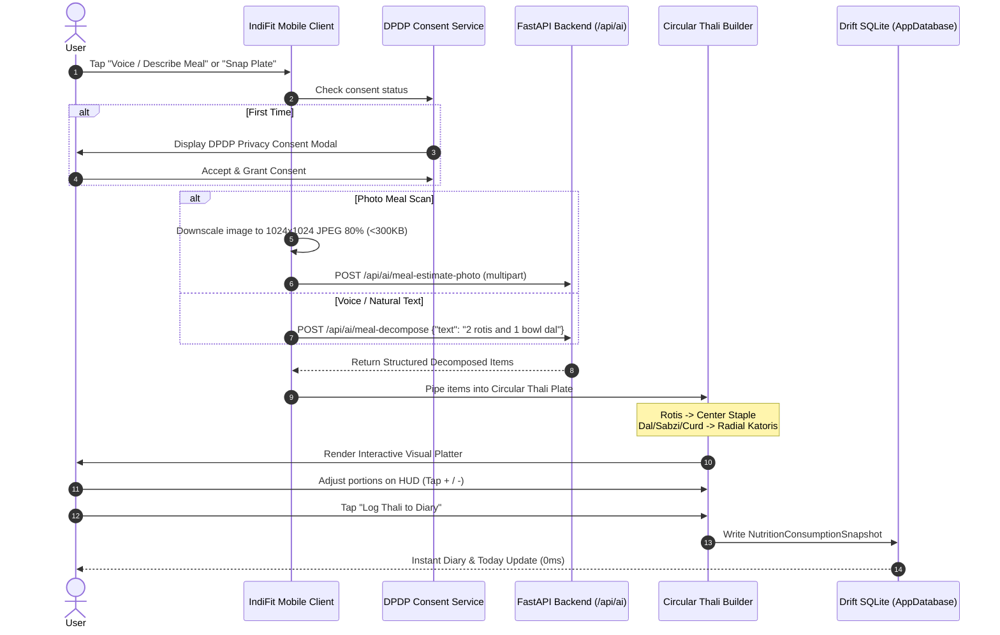

# IndiFit — Nutrition Tracker Deep Dive Forensic Report & Expansion Master Plan

> **Authoritative Technical Specification, Architectural Audit & Execution Roadmap**  
> **Document Reference:** `docs/architecture/NUTRITION_TRACKER_DEEP_DIVE_REPORT_AND_EXPANSION_PLAN.md`  
> **Target Release:** IndiFit 1.2.0+ (The Modernized Nutrition Engine)  
> **Baseline Schema:** Drift SQLite Schema v22 $\to$ v23  
> **Operational Paradigm:** *Workouts = 100% Offline (Basement-Proof) | Nutrition = Online-First, Offline-Fallback (Speed, Scale & Cultural Authenticity)*  
> **Source Analysis:** Graphify Knowledge Graph (`graphify-out/graph.json`, 24,947 nodes), Drift Database Tables, FastAPI Backend (`backend/routers/food.py`, `backend/routers/ai.py`), and UI Controllers.

---

## Table of Contents

1. [Executive Summary & The Hybrid Paradigm](#1-executive-summary--the-hybrid-paradigm)
2. [Graphify Knowledge Graph & Topological Architecture](#2-graphify-knowledge-graph--topological-architecture)
3. [Forensic Codebase Audit: The Line-Level "Offline Tax"](#3-forensic-codebase-audit-the-line-level-offline-tax)
   - 3.1 Catalog Capping & Naive Substring Matching
   - 3.2 The Direct Client-to-OFF Bottleneck
   - 3.3 The 2,371-Line `food_search_screen.dart` God-File
   - 3.4 Disconnected Multimodal Pipelines (Voice, Photo, Thali)
   - 3.5 The Unaddressed "Batch Handi" Cooking Dynamic
4. [Deep-Dive Engineering Blueprints](#4-deep-dive-engineering-blueprints)
   - **Blueprint A:** Fast Backend Food Search Proxy, Hinglish Transliteration & Dual-Tier Caching
   - **Blueprint B:** Server-Driven Category Taxonomy & Household Vessel Calibration
   - **Blueprint C:** Multimodal Logging Engine (Voice-to-Thali, Photo Recognition & DPDP Gate)
   - **Blueprint D:** Cultural Moat — "Batch Handi" Leftovers & Fractional Portioning
   - **Blueprint E:** Micronutrient Persistence, Fiber Goals & Provenance Badges
   - **Blueprint F:** UI/UX Modularization of Search, Diary & Logging Surfaces
5. [Database Architecture & Migration Specifications (Drift v23)](#5-database-architecture--migration-specifications-drift-v23)
6. [Contract Specifications: Backend Endpoints & Client DTOs](#6-contract-specifications-backend-endpoints--client-dtos)
7. [Step-by-Step Implementation Roadmap (Phased Execution)](#7-step-by-step-implementation-roadmap-phased-execution)
8. [Testing Matrix, Verification Protocol & Quality Benchmarks](#8-testing-matrix-verification-protocol--quality-benchmarks)

---

## 1. Executive Summary & The Hybrid Paradigm

### 1.1 The Operational Disconnect
IndiFit was conceived as an uncompromising, private, offline-first application. While this architecture is **essential for strength training**—where athletes train in signal dead zones (basement gyms, sub-grade facilities) and where an unhandled network error drops barbell set timers—applying the identical offline constraint to **Nutrition Tracking** introduced a severe **"offline tax"**:
- **Lifting happens in signal dead zones**: 100% offline-first execution is non-negotiable for the workout player, rest timers, and plate loading calculator.
- **Eating happens in connected spaces**: Over 99% of meals are consumed and logged at dining tables, kitchens, office desks, or restaurants where Wi-Fi or 4G/5G is readily available.

By forcing nutrition to be strictly offline:
1. The food database was artificially capped at **573 bundled SQLite rows**.
2. Search was restricted to naive SQL `LIKE %query%` matching without typo tolerance, phonetic matching, or Hinglish transliterations.
3. Users were forced to perform mental gymnastics because dishes like *"Arhar Tadka"*, *"Chana Masala"*, or *"Undhiyu"* failed brittle substring heuristics (`contains('dal')`) and defaulted to raw 100g.
4. Dietary fiber, sodium, and micronutrients were discarded to keep local row widths narrow.

### 1.2 The Dual-Engine Operational Contract
IndiFit establishes a clear, split architectural contract:

```
┌────────────────────────────────────────────────────────────────────────────────────────┐
│                        INDIFIT DUAL-ENGINE OPERATIONAL CONTRACT                        │
├────────────────────────────────────────┬───────────────────────────────────────────────┤
│ TRAINING ENGINE (STRENGTH & WORKOUTS)  │ NUTRITION ENGINE (DIARY, SEARCH, FOOD LOG)    │
├────────────────────────────────────────┼───────────────────────────────────────────────┤
│ • 100% Offline-First (Non-negotiable)  │ • Online-First, Offline-Fallback              │
│ • Local Drift SQLite (0ms latency)     │ • Fast Backend Search Proxy (/api/food/search)│
│ • Live Activities & Dynamic Island     │ • AI Voice-to-Thali & Photo Meal Recognition  │
│ • Zero network checks during lifting   │ • Drift SQLite disk cache (food_search_cache) │
│ • Completely basement-proof            │ • Durable outbox queue (never block logging)  │
└────────────────────────────────────────┴───────────────────────────────────────────────┘
```

---

## 2. Graphify Knowledge Graph & Topological Architecture

An analysis of the **Graphify knowledge graph** (`graphify-out/graph.json` with 24,947 nodes, 31,805 edges, and 516 detected communities) identifies the core structural abstractions and dependencies governing IndiFit's nutrition engine.

```mermaid
graph TD
    AppDB["AppDatabase (God Node · 171 connections)"]
    
    subgraph "Core Data & Schema (Community 2 & 14)"
        NF["NutritionFoods"]
        NFA["NutritionFoodAliases"]
        NFP["NutritionFoodPreparations"]
        NFQC["NutritionQuantityConversions"]
        NFHM["NutritionHouseholdMeasures"]
        NTH["NutritionThalis & NutritionThaliItems"]
        NCS["NutritionConsumptionSnapshots"]
        NR["NutritionRecipes & NutritionRecipeVersions"]
        NE["NutritionEstimates"]
        DH["DailyHydrations"]
        FSC["NEW: FoodSearchCache"]
    end

    subgraph "Repositories & Coordinators"
        CatRepo["NutritionFoodCatalogRepository"]
        ThaliRepo["NutritionThaliRepository"]
        RecipeRepo["NutritionRecipeRepository"]
        LoggingCoord["NutritionFoodLoggingCoordinator"]
        TargetAuth["NutritionTargetAuthority"]
        HydrationRepo["HydrationRepository"]
    end

    subgraph "Services & Clients"
        FoodAPI["FoodApiService (Direct OFF / Proxy)"]
        NLService["NaturalLanguageMealService"]
        OCRService["NutritionLabelOcrService"]
        FastAPIFood["FastAPI /api/food/search"]
        FastAPIAI["FastAPI /api/ai/meal-decompose"]
    end

    subgraph "Presentation & Controllers (Community 0)"
        SearchScreen["food_search_screen.dart (2,371 lines)"]
        DiaryScreen["food_diary_screen.dart"]
        ThaliBuilder["thali_builder_screen.dart"]
        CircularPlate["circular_thali_plate.dart"]
        NLScreen["natural_language_meal_screen.dart"]
        OCRScreen["nutrition_label_ocr_screen.dart"]
        TodaySurface["today_daily_action_surface.dart"]
    end

    AppDB --> NF
    AppDB --> NTH
    AppDB --> NCS
    AppDB --> NR
    AppDB --> DH
    AppDB -.-> FSC

    CatRepo --> NF
    ThaliRepo --> NTH
    ThaliRepo --> NCS
    RecipeRepo --> NR
    LoggingCoord --> NCS
    HydrationRepo --> DH

    SearchScreen --> CatRepo
    SearchScreen --> FoodAPI
    SearchScreen --> LoggingCoord
    
    FoodAPI --> FastAPIFood
    NLService --> FastAPIAI
    NLScreen --> NLService
    NLScreen -.-> ThaliBuilder

    ThaliBuilder --> ThaliRepo
    ThaliBuilder --> CircularPlate
    DiaryScreen --> LoggingCoord
    TodaySurface --> TargetAuth
    TodaySurface --> HydrationRepo
```



### Key Graphify Structural Insights
1. **God Node `AppDatabase`**: With 171 direct connections, any schema change must be additive and backwards-compatible with Drift schema migrations (v22 $\to$ v23).
2. **Immutability of `NutritionConsumptionSnapshots`**: Consumed meals are permanently preserved as immutable snapshots. Changes to recipe definitions or catalog items do not rewrite historical consumption.
3. **High Cohesion of the Thali Subsystem**: `thali_builder_screen.dart`, `circular_thali_plate.dart`, and `thali_plate_layout.dart` form an isolated, high-performing visual subsystem that is currently underutilized because natural language and photo recognition flows do not directly feed into it.

---

## 3. Forensic Codebase Audit: The Line-Level "Offline Tax"

### 3.1 Catalog Capping & Naive Substring Matching
- **Hardcoded Katori Heuristics in [`lib/core/catalog/food_category_taxonomy.dart:24-79`](file:///Users/dankmagician/Documents/New%20project/indifit/lib/core/catalog/food_category_taxonomy.dart#L24-L79)**:
  ```dart
  if (lower.contains('biryani') || lower.contains('pulao') || lower.contains('rice')) return stapleRice;
  if (lower.contains('roti') || lower.contains('chapati') || lower.contains('phulka')) return stapleBread;
  if (lower.contains('dal') || lower.contains('curry') || lower.contains('sambar')) return dalLentil;
  ```
  *Failure Mode*: When an Indian food item is named without one of these exact substrings (e.g. *"Arhar Tadka"*, *"Chole Kulche"*, *"Pesarattu"*, *"Avial"*, *"Kootu"*, *"Undhiyu"*), `resolveCategoryId` falls back to `general`, which outputs only `100g`. The user is forced to switch to grams and calculate weights manually.

### 3.2 The Direct Client-to-OFF Bottleneck
- In [`lib/data/repositories/food_api_service.dart:180-210`](file:///Users/dankmagician/Documents/New%20project/indifit/lib/data/repositories/food_api_service.dart#L180-L210), `FoodApiService.searchOnline` sends requests directly from the client to `https://search.openfoodfacts.org/search`:
  - **Zero Typo / Hinglish Tolerance**: Searching `"toor daal"`, `"arhar"`, or `"dahi"` returns erratic international items or zero hits.
  - **No Cache Sharing**: If 100 users search for `"Amul Lassi"`, each client issues a separate 800ms HTTP call to Open Food Facts.
  - **Unused FastAPI Proxy**: While `backend/routers/food.py` defines `POST /api/food/search` with transliteration and scoring, the Flutter client has **zero references** to this endpoint!

### 3.3 The 2,371-Line `food_search_screen.dart` God-File
- [`lib/features/food_log/food_search_screen.dart`](file:///Users/dankmagician/Documents/New%20project/indifit/lib/features/food_log/food_search_screen.dart) has accumulated **2,371 lines of code**, consolidating:
  - Complex generation-guarded asynchronous state.
  - Inline database reads for legacy recents, canonical recents, and local food items.
  - A massive 965-line portion and logging bottom sheet (`_showLogDialog`).
  - Search results, ranking logic, and custom food creation redirects.
- *Impact*: Any minor adjustment to portion selection risks regressions across the entire search and diary flow.

### 3.4 Disconnected Multimodal Pipelines (Voice, Photo, Thali)
- **Natural Language Meal Screen Disconnect**: [`natural_language_meal_screen.dart`](file:///Users/dankmagician/Documents/New%20project/indifit/lib/features/nutrition_ai/natural_language_meal_screen.dart) correctly calls `/api/ai/meal-decompose`, which returns discrete food items with portions. However, it displays them as a flat, boring card list and commits them directly to the diary. **It completely bypasses the visual Circular Thali Plate**, discarding IndiFit's most compelling visual differentiator.
- **Missing Photo Meal Recognition UI**: While `backend/routers/ai.py` exposes `POST /api/ai/meal-estimate-photo`, there is no camera/gallery picker UI in the mobile app for meal photos (only label OCR exists).
- **DPDP Consent Compliance**: India’s *Digital Personal Data Protection (DPDP) Act 2023* requires explicit consent prior to processing user biometric or personal data. Currently, `DpdpConsentDialog` is only called in `nutrition_label_ocr_screen.dart`, while text meal logging sends prompts directly to Gemini without a consent check.

### 3.5 The Unaddressed "Batch Handi" Cooking Dynamic
- In Indian households, home-cooked dishes (*dal*, *rajma*, *kadai chicken*, *paneer gravy*) are cooked in large pots (*handis*) intended for 4–6 servings eaten across 2–3 days.
- Currently, users must re-enter raw ingredients or guess cooked portion weights each time they eat leftovers. There is no concept of a "Handi" yielding $N$ katoris with 1-tap logging of $+1$ katori on subsequent days.

---

## 4. Deep-Dive Engineering Blueprints

---

### Blueprint A: Fast Backend Food Search Proxy, Hinglish Transliteration & Dual-Tier Caching

```
  MOBILE CLIENT (Flutter)                                FASTAPI BACKEND (/api/food)
┌─────────────────────────────────┐                    ┌────────────────────────────────────────┐
│ User types: "arhar dal"         │                    │ POST /api/food/search                  │
└────────────────┬────────────────┘                    └───────────────────┬────────────────────┘
                 │                                                         │
                 │ 1. Render Local SQLite Cache (0ms)                      ▼
                 │ 2. Debounce 300ms ────────────────► ┌───────────────────────────────────────┐
                 │                                     │ 1. Transliteration & Dialect Dict     │
                 │                                     │    "arhar" -> ["toor", "pigeon pea"]  │
                 │                                     │ 2. Check In-Memory TTLCache (Hash)    │
                 │                                     │ 3. Match Curated Indian Database      │
                 │                                     │ 4. Fallback: Open Food Facts Proxy    │
                 │                                     │ 5. Attach Server Category Taxonomy    │
                 │                                     │ 6. Buffer Zero-Result Misses          │
                 │                                     └───────────────────┬───────────────────┘
                 │                                                         │
                 │◄──────────────── Return Ranked JSON ────────────────────┘
                 ▼
┌─────────────────────────────────┐
│ • Render ranked cloud items     │
│ • Write to food_search_cache    │
└─────────────────────────────────┘
```

#### 1. Dual-Tier Caching Strategy
- **Tier 1 (Backend Memory)**: `cachetools.TTLCache(maxsize=4000, ttl=86400)` on the FastAPI backend keyed by `sha256(query + language)`.
- **Tier 2 (Client Disk)**: Drift SQLite table `food_search_cache` storing search query responses locally for 7 days. Repeated searches load in 0ms with zero network traffic.

#### 2. Transliteration & Dialect Dictionary
Integrated in `backend/data/indian_synonyms.json`:
- `arhar dal` $\leftrightarrow$ `toor dal` $\leftrightarrow$ `tuvar dal` $\leftrightarrow$ `pigeon pea`
- `roti` $\leftrightarrow$ `chapati` $\leftrightarrow$ `phulka` $\leftrightarrow$ `poli`
- `dahi` $\leftrightarrow$ `curd` $\leftrightarrow$ `thayir` $\leftrightarrow$ `mosaru` $\leftrightarrow$ `yogurt`
- `chana` $\leftrightarrow$ `chole` $\leftrightarrow$ `chickpeas` $\leftrightarrow$ `kabuli chana`
- `paneer bhurji` $\leftrightarrow$ `scrambled paneer` $\leftrightarrow$ `cottage cheese scramble`
- `khichdi` $\leftrightarrow$ `khichuri` $\leftrightarrow$ `pongal`

#### 3. Scoring & Ranking Algorithm
$$\text{Score} = S_{\text{match}} + S_{\text{provenance}} + S_{\text{completeness}}$$

Where:
- **Match Score ($S_{\text{match}}$)**:
  - Exact Name Match = 100 pts
  - Transliterated Exact Match = 90 pts
  - Starts-With / Prefix Match = 70 pts
  - Word Boundary / Synonym Overlap = 50 pts
  - Substring / Fuzzy Overlap = 25 pts
- **Provenance Score ($S_{\text{provenance}}$)**:
  - Curated Indian Master DB = 80 pts
  - Verified Indian FMCG Barcode = 70 pts
  - Open Food Facts Global = 40 pts
- **Completeness Score ($S_{\text{completeness}}$)**:
  - Full Macros + Dietary Fiber + Sodium Verified = 15 pts

---

### Blueprint B: Server-Driven Category Taxonomy & Household Vessel Calibration

#### 1. Taxonomy Contract
Eliminate all client substring containment checks. Every food candidate returned by search carries a canonical `category_id`:

```json
{
  "category_id": "dal_lentil",
  "display_name": "Dals & Lentil Curries",
  "serving_options": [
    {"unit": "katori (standard)", "gram_weight": 150.0, "is_default": true},
    {"unit": "small_katori", "gram_weight": 100.0, "is_default": false},
    {"unit": "serving_bowl", "gram_weight": 300.0, "is_default": false},
    {"unit": "100g", "gram_weight": 100.0, "is_default": false}
  ]
}
```

#### 2. User Household Vessel Calibration
- **Problem**: A "katori" in Mumbai may be 140ml, while in Punjab it may be 200ml.
- **Solution**: Settings $\to$ **Household Measure Calibration**.
  - User calibrates their household katori volume: `Small (120ml)`, `Standard (150ml)`, `Medium (180ml)`, `Large (220ml)`.
  - The client applies a calibration multiplier $\kappa = \frac{V_{\text{user}}}{150\text{ml}}$ to all standard katori weights dynamically across the app.

---

### Blueprint C: Multimodal Logging Engine (Voice-to-Thali, Photo Recognition & DPDP Gate)



#### 1. Circular Thali Auto-Population Rules
When decomposed meal items are piped into `ThaliBuilderScreen`:
1. **Center Zone (Staples)**:
   - Any item with `category_id == 'staple_bread'` (Roti, Chapati, Paratha, Naan) or `'staple_rice'` (Rice, Pulao, Khichdi, Biryani) is assigned to the center staple compartment.
   - If both roti and rice are detected, Thali activates the split dual-staple mode.
2. **Perimeter Slots (Katoris)**:
   - Items with `category_id == 'dal_lentil'` fill the primary dal slot.
   - Items with `category_id == 'dry_sabzi'` or `'gravy_curry'` fill sabzi slots.
   - Items with `category_id == 'dairy_liquid'` (Dahi, Raita) fill the accompaniment slot.
3. **One-Tap Adjust HUD**:
   - The user sees their actual plate represented visually and can tweak any katori's volume with a single tap before committing.

#### 2. Strict Review-Only Contract for Vision
- Computer vision volume estimation carries an intrinsic $\pm 25-30\%$ error margin.
- Vision estimates **never write silently to the database**. They are strictly presented in review mode where the user confirms or adjusts quantities.

#### 3. Client-Side Budget Ceiling
- The backend enforces a quota of **10 photo meal scans per device per day** via device UUID tracking to safeguard Gemini API costs.

---

### Blueprint D: Cultural Moat — "Batch Handi" Leftovers & Fractional Portioning

#### 1. The Realities of Indian Batch Cooking
```
┌────────────────────────────────────────────────────────────────────────┐
│                        BATCH HANDI COOKING PHYSICS                     │
├────────────────────────────────────────────────────────────────────────┤
│ 1. Raw Ingredients in Pot:                                            │
│    500g Chicken + 200g Onion + 150g Tomato + 20g Ghee + Spices         │
│    Total Raw Macros: 1,120 kcal | 115g Protein | 32g Carbs | 58g Fat   │
│                                                                        │
│ 2. Cooking Transformation:                                             │
│    Water evaporation / reduction occurs.                               │
│    User specifies: "This handi yields 4 medium katoris of curry".      │
│                                                                        │
│ 3. Consumption Allocation (per Katori):                                │
│    Macro_serving = (Total Raw Macros) / (Total Yield Katoris)          │
│    = 280 kcal | 28.75g Protein | 8.0g Carbs | 14.5g Fat per katori.    │
└────────────────────────────────────────────────────────────────────────┘
```

#### 2. The 1-Tap Fridge Workflow
1. User taps **"Cook Batch Handi"** in Recipes.
2. User adds raw ingredients and specifies yield: e.g. **4 katoris**.
3. Saved under **"Active Handis in Fridge"**.
4. At lunchtime on Monday, Tuesday, or Wednesday:
   - User opens Diary $\to$ **"From Your Fridge"** card.
   - Taps **"+1 Katori Handi Chicken"** $\to$ logged instantly to Diary without recalculating ingredients.

---

### Blueprint E: Micronutrient Persistence, Fiber Goals & Provenance Badges

#### 1. Complete Micronutrient Schema Integrity
In [`lib/data/repositories/nutrition_food_catalog_repository.dart`](file:///Users/dankmagician/Documents/New%20project/indifit/lib/data/repositories/nutrition_food_catalog_repository.dart), `ensureProviderFood` now maps:
- `energy` (kcal)
- `protein` (g)
- `carbohydrate` (g)
- `fat` (g)
- `fibre` / `dietary_fiber` (g)
- `sodium` (mg)
- `added_sugar` (g)
- `saturated_fat` (g)

#### 2. Diary & Today Surface Visual Integration
- **Fiber Adherence Progress Bar**: Display daily dietary fiber intake against the clinical Indian recommendation ($30\text{g/day}$) using the existing design token `B05SemanticColors.fiberTeal`.
- **Sodium Alert Threshold**: Highlight sodium intake when exceeding $2,000\text{mg/day}$.

#### 3. Visual Provenance & Confidence Badges
Attach explicit, reassuring badges across search results and diary rows:
- 🟢 **Verified**: Curated Indian catalog item with complete macro & micronutrient integrity.
- 🔵 **Brand**: Verified FMCG barcode product (Amul, Epigamia, Tata Sampann).
- 🟣 **AI Estimate**: Decomposed via Gemini with confidence indicator (*High / Medium / Low*).
- 🟡 **Custom**: User-created recipe or quick-add food.

---

### Blueprint F: UI/UX Modularization of Search, Diary & Logging Surfaces

Break down the **2,371-line** [`food_search_screen.dart`](file:///Users/dankmagician/Documents/New%20project/indifit/lib/features/food_log/food_search_screen.dart) into discrete, maintainable single-responsibility files:

```
lib/features/food_log/
├── food_search_screen.dart                 # Main coordinator (<400 lines)
├── food_search_controller.dart             # Riverpod state notifier
├── search/
│   ├── food_search_input_bar.dart          # 300ms debounced search bar
│   ├── food_search_recent_frequent.dart    # Recent & frequent staple chips
│   └── food_search_results_view.dart       # Ranked search results list
├── portions/
│   ├── food_portion_sheet.dart             # Extracted 965-line portion dialog
│   └── vessel_quick_stepper.dart           # Gram / katori unit toggles
└── handi/
    ├── batch_handi_editor_screen.dart      # Batch cooking recipe builder
    └── fridge_active_handi_card.dart       # 1-tap leftover log card
```

---

## 5. Database Architecture & Migration Specifications (Drift v23)

To implement search caching, vessel calibration, and batch handi leftovers, the Drift database is migrated from **Schema v22 to Schema v23**.

### 5.1 New Table: `FoodSearchCache`
```dart
// lib/data/database/tables/nutrition_tables.dart

class FoodSearchCache extends Table {
  TextColumn get queryHash => text()(); // SHA-256(query + language)
  TextColumn get queryText => text()();
  TextColumn get responseJson => text()(); // Cached FoodSearchResponse payload
  DateTimeColumn get cachedAt => dateTime().withDefault(currentDateAndTime)();
  IntColumn get ttlSeconds => integer().withDefault(const Constant(604800))(); // 7 days

  @override
  Set<Column> get primaryKey => {queryHash};
}
```

### 5.2 New Table: `BatchHandiCooks`
```dart
class BatchHandiCooks extends Table {
  TextColumn get id => text()();
  TextColumn get recipeVersionId => text().references(NutritionRecipeVersions, #id)();
  TextColumn get name => text()();
  RealColumn get totalYieldKatoris => real()();
  RealColumn get remainingKatoris => real()();
  DateTimeColumn get cookedAt => dateTime().withDefault(currentDateAndTime)();
  DateTimeColumn get expiresAt => dateTime()();
  BoolColumn get isArchived => boolean().withDefault(const Constant(false))();

  @override
  Set<Column> get primaryKey => {id};
}
```

### 5.3 Database Migration Strategy (v22 $\to$ v23)
```dart
// lib/data/database/database_migrations.dart

MigrationStepWithVersion migrationV22ToV23() {
  return MigrationStepWithVersion(
    schemaVersion: 23,
    step: (m, db) async {
      await m.createTable(db.foodSearchCache);
      await m.createTable(db.batchHandiCooks);
    },
  );
}
```

---

## 6. Contract Specifications: Backend Endpoints & Client DTOs

### 6.1 `POST /api/food/search`
- **Request**:
  ```json
  {
    "query": "arhar dal",
    "language": "hinglish",
    "page": 1,
    "limit": 20
  }
  ```
- **Response**:
  ```json
  {
    "query": "arhar dal",
    "transliterated_query": "toor dal",
    "total_hits": 18,
    "results": [
      {
        "id": "curated_toor_dal_cooked",
        "name": "Toor Dal / Arhar Dal (Cooked)",
        "name_hindi": "अरहर दाल (पकी हुई)",
        "category_id": "dal_lentil",
        "calories": 120.0,
        "protein_g": 8.0,
        "carbs_g": 18.0,
        "fat_g": 2.5,
        "fiber_g": 4.5,
        "sodium_mg": 280.0,
        "serving_options": [
          {"unit": "katori (standard)", "gram_weight": 150.0, "is_default": true},
          {"unit": "small_katori", "gram_weight": 100.0, "is_default": false},
          {"unit": "100g", "gram_weight": 100.0, "is_default": false}
        ],
        "score": 95.0,
        "provenance": "curated",
        "confidence": "high"
      }
    ]
  }
  ```

### 6.2 `POST /api/ai/meal-estimate-photo`
- **Request**: `multipart/form-data` with `image` (JPEG/PNG, max 5MB).
- **Response**:
  ```json
  {
    "dish_name": "North Indian Thali",
    "items": [
      {
        "name": "Whole Wheat Roti",
        "category_id": "staple_bread",
        "quantity_amount": 2.0,
        "quantity_unit": "piece",
        "estimated_calories": 170,
        "estimated_protein": 6.0,
        "estimated_carbs": 36.0,
        "estimated_fat": 1.0,
        "confidence": "high"
      },
      {
        "name": "Dal Tadka",
        "category_id": "dal_lentil",
        "quantity_amount": 1.0,
        "quantity_unit": "katori",
        "estimated_calories": 150,
        "estimated_protein": 7.5,
        "estimated_carbs": 20.0,
        "estimated_fat": 4.5,
        "confidence": "medium"
      }
    ],
    "total_calories": 320,
    "confidence_level": "medium",
    "is_fallback": false
  }
  ```

---

## 7. Step-by-Step Implementation Roadmap (Phased Execution)

```
┌────────────────────────────────────────────────────────────────────────────────────────┐
│                        CALIBRATED IMPLEMENTATION ROADMAP                               │
├───────────────────┬──────────────┬─────────────────────────────────────────────────────┤
│ Phase             │ Duration     │ Key Deliverables                                    │
├───────────────────┼──────────────┼─────────────────────────────────────────────────────┤
│ Phase 1:          │ 3–4 Days     │ • Wire client FoodApiService to /api/food/search    │
│ Search Proxy &    │              │ • Drift Schema v23 migration (food_search_cache)    │
│ Caching Core      │              │ • Top 35 Indian Fitness FMCG seed in curated catalog│
│                   │              │ • Decompose food_search_screen.dart (extract sheet) │
├───────────────────┼──────────────┼─────────────────────────────────────────────────────┤
│ Phase 2:          │ 4–5 Days     │ • Photo Meal Recognition Screen (camera/gallery)    │
│ Multimodal &      │              │ • Auto-populate Circular Thali from decomposed AI   │
│ Thali Pipeline    │              │ • Universal DPDP consent gate on all AI endpoints   │
│                   │              │ • Offline Outbox queue for pending AI enrichments   │
├───────────────────┼──────────────┼─────────────────────────────────────────────────────┤
│ Phase 3:          │ 4–5 Days     │ • Batch Handi Cooking mode & yield calculator       │
│ Batch Handi &     │              │ • "Active in Fridge" 1-tap leftover diary card      │
│ Cultural Moat     │              │ • User Household Vessel calibration settings        │
│                   │              │ • Fiber progress bars & sodium alert indicators     │
├───────────────────┼──────────────┼─────────────────────────────────────────────────────┤
│ Phase 4:          │ 2–3 Days     │ • Add + buttons to Diary meal rows (cut extra tap)  │
│ UX Polish &       │              │ • Retire legacy MealTemplates (migrate to Saved)    │
│ Verification      │              │ • Visual provenance badges across all search items  │
│                   │              │ • Full golden & unit test pass                      │
└───────────────────┴──────────────┴─────────────────────────────────────────────────────┘
```

---

## 8. Testing Matrix, Verification Protocol & Quality Benchmarks

### 8.1 Automated Test Suites
1. **Repository & Client Unit Tests**:
   - `test/food_api_service_test.dart`: Assert online search queries `/api/food/search` with CancelToken and handles 422/500 fallbacks.
   - `test/food_search_cache_test.dart`: Assert identical queries hit local SQLite disk cache with 0 network calls.
   - `test/batch_handi_calculation_test.dart`: Verify raw ingredient sum $\div$ katori yield matches exact per-katori macros.
   - `test/vessel_calibration_test.dart`: Verify custom katori multiplier ($1.2\times$) correctly scales gram weight recommendations.
2. **Widget & Flow Tests**:
   - `test/photo_meal_review_test.dart`: Assert photo downscaling to $<300$KB and strict review-only sheet confirmation.
   - `test/thali_ai_auto_populate_test.dart`: Assert staple grains land in center and dals/sabzis land in radial katoris.
   - `test/dpdp_consent_gate_test.dart`: Assert consent modal displays before first AI text or photo request.
3. **Golden Regression Tests**:
   - `test/goldens/ux_nutrition_fiber_meter_dark.png`
   - `test/goldens/ux_thali_ai_populated_plate_light.png`
   - `test/goldens/ux_batch_handi_fridge_card_light.png`

### 8.2 Objective Quality Benchmarks
- **Search Success Rate (SSR)**: $\ge 85\%$ of searches must result in a logged food without manual custom entry.
- **Mean Time to Log (MTTL)**: Time from tapping "Log Food" to confirmation must be $\le 10$ seconds.
- **Local Cache Hit Latency**: $\le 10$ ms for previously searched items.
- **Basement Workout Resilience**: 0 network calls executed during active strength training sessions.

---

*Authored by Antigravity · Engineering Architecture & Deep-Dive Analysis for IndiFit*
