# IndiFit Nutrition Tracker — Master Analysis Report & Implementation Plan

> **Authoritative Engineering Specification & Production Blueprint (Post-Review Hardened)**  
> **Document Reference:** `docs/implementation/NUTRITION_TRACKER_UPGRADE_EXPANSION_PLAN.md`  
> **Target Release:** IndiFit 1.2.0+ (Nutrition Modernization Milestone)  
> **Status:** Finalized Master Plan — 100% Executable, Hardened Against All 5 Review Blockers  
> **Core Principle:** *Workouts = 100% Offline (Basement-Proof) | Nutrition = Online-First, Offline-Fallback (Speed, Scale & Cultural Authenticity)*  
> **Evidence Base:** Graphify Knowledge Graph (`graphify-out/`, 24,947 nodes), Drift SQLite Schema v22, FastAPI Backend (`backend/routers/`), UI Controllers, and Historical Batch Records (`B03 / R07D / R08D / CATALOG01A / NUTRITION_SEGMENT_ONLINE_FIRST_TRANSFORMATION`).

---

## Table of Contents

1. [Executive Summary & The Dual-Engine Operational Contract](#1-executive-summary--the-dual-engine-operational-contract)
2. [Graphify Knowledge Graph & Topological Architecture](#2-graphify-knowledge-graph--topological-architecture)
3. [Forensic Codebase Audit & Line-Level "Offline Tax" Register](#3-forensic-codebase-audit--line-level-offline-tax-register)
4. [Strengths to Preserve (The Invariant Core)](#4-strengths-to-preserve-the-invariant-core)
5. [Competitive Gap Analysis (vs. MyFitnessPal, HealthifyMe, MacroFactor)](#5-competitive-gap-analysis-vs-myfitnesspal-healthifyme-macrofactor)
6. [Strategic Scope Lock & Disciplined Phasing](#6-strategic-scope-lock--disciplined-phasing)
7. [Track A: Online-First Hybrid Search & Caching Engine](#7-track-a-online-first-hybrid-search--caching-engine)
   - 7.1 Backend Proxy Contract (`POST /api/food/search` & `GET /api/food/barcode/{code}`)
   - 7.2 In-Memory TTLCache & Canonical Synonym Clusters
   - 7.3 Top-35 Indian Fitness FMCG Starter Seed & ODbL Provenance
   - 7.4 Client Drift SQLite `FoodSearchCache` (Schema v23 Additive & Backup Exclusion)
   - 7.5 Elimination of Substring Containment Heuristics
8. [Track B: Diary UX & 10-Second Speed Overhaul](#8-track-b-diary-ux--10-second-speed-overhaul)
   - 8.1 Sticky Overview Header & Targets Hub Deep-Linking
   - 8.2 The 10-Second Quick-Add Macros Sheet & TDEE Down-Weighting
   - 8.3 Scoped Direct-Food Swipe-Delete & Undo
   - 8.4 Copy-Yesterday, Eat-Again & Inline Target Presets
9. [Track C: AI Multimodal Engine with Review-Only Safety](#9-track-c-ai-multimodal-engine-with-review-only-safety)
   - 9.1 Activating Dormant NLP Controller Editing (Quantity Steppers & Catalog Swap)
   - 9.2 Photo Meal Estimator V2 (Review-Only, Client Downscaling & Spend Ceiling)
   - 9.3 9-Nutrient OCR Expansion with Custom Gram Portions
   - 9.4 Continuous Barcode Scanner Session
   - 9.5 Universal DPDP Act 2023 Consent Gate & Offline Outbox Queue
10. [Cross-Cutting Architecture: Data Model, Drift v23 Migration & API Contracts](#10-cross-cutting-architecture-data-model-drift-v23-migration--api-contracts)
11. [Step-by-Step Implementation Roadmap & Delivery Sequencing](#11-step-by-step-implementation-roadmap--delivery-sequencing)
12. [Verification Protocol, Automated Test Matrix & Quality Benchmarks](#12-verification-protocol-automated-test-matrix--quality-benchmarks)
13. [Risks, Mitigations & Appendix Traceability Index](#13-risks-mitigations--appendix-traceability-index)

---

## 1. Executive Summary & The Dual-Engine Operational Contract

The nutrition tracker represents the most specified and conceptually sound segment of IndiFit (B03 gate passed, R07D-1/2/3 verified, R08D.2 fast logging established). The underlying data foundations—immutable `NutritionConsumptionSnapshots` with frozen facts, versioned `NutritionGoalVersions`, envelope-based `NutritionEstimates`, and taxonomy-gated `NutritionConstraints`—are production-grade and will **not** be rewritten.

However, applying IndiFit's strict "offline-first" ethos to nutrition tracking imposed an unnecessary, crippling **"offline tax"**:
* **Lifting happens in basements**: Heavy barbell sets, RPE logging, rest timers, and plate calculations occur in signal dead zones where mobile reception drops. The **100% offline-first requirement is non-negotiable for the Workout Player**.
* **Eating happens in connected spaces**: Over 99% of meals are logged in kitchens, at dining tables, at work desks, in restaurants, or at grocery aisles where 4G/5G or home Wi-Fi is readily available.

By forcing food logging to be offline-only:
1. The food catalog was artificially capped at **573 bundled SQLite rows**.
2. Search was limited to naive `LIKE %query%` matching, with zero tolerance for typos, Hinglish transliterations, or regional dish names.
3. Users suffered mental friction as dishes like *"Arhar Tadka"*, *"Chana Masala"*, *"Kootu"*, or *"Undhiyu"* failed brittle substring heuristics (`contains('dal')`) and defaulted to raw 100g.
4. Dietary fiber, sodium, added sugar, and saturated fat were discarded to keep local row widths narrow.
5. Diary entry required a heavy multi-step flow (Search $\to$ Food $\to$ Portion $\to$ Preview $\to$ Finalize) with no 10-second quick-add.

### The Dual-Engine Operational Contract

```
┌────────────────────────────────────────────────────────────────────────────────────────┐
│                        INDIFIT DUAL-ENGINE OPERATIONAL CONTRACT                        │
├────────────────────────────────────────┬───────────────────────────────────────────────┤
│ TRAINING ENGINE (STRENGTH & WORKOUTS)  │ NUTRITION ENGINE (DIARY, SEARCH, FOOD LOG)    │
├────────────────────────────────────────┼───────────────────────────────────────────────┤
│ • 100% Offline-First (Non-negotiable)  │ • Online-First, Offline-Fallback              │
│ • Local Drift SQLite (0ms latency)     │ • Fast Backend Search Proxy (/api/food/search)│
│ • Live Activities & Dynamic Island     │ • AI Voice, NLP Decompose & Photo Recognition │
│ • Zero network checks during lifting   │ • Drift SQLite disk cache (food_search_cache) │
│ • Completely basement-proof            │ • Durable outbox queue (never block logging)  │
└────────────────────────────────────────┴───────────────────────────────────────────────┘
```

---

## 2. Graphify Knowledge Graph & Topological Architecture

The **Graphify knowledge graph** (`graphify-out/graph.json` with 24,947 nodes, 34,666 edges, and 724 communities) highlights the exact topology, hubs, and blast-radius centers:

```mermaid
graph TD
    AppDB["AppDatabase (God Node · 172 edges · Schema v22)"]
    
    subgraph "Core Data Foundations (Community 1 & 14)"
        NF["NutritionFoods"]
        NFA["NutritionFoodAliases"]
        NFP["NutritionFoodPreparations"]
        NFQC["NutritionQuantityConversions"]
        NFHM["NutritionHouseholdMeasures"]
        NTH["NutritionThalis & ThaliItems"]
        NCS["NutritionConsumptionSnapshots (Immutable Authority)"]
        NR["NutritionRecipes & Versions"]
        NE["NutritionEstimates (Envelope-based)"]
        NGV["NutritionGoalVersions"]
        FSC["NEW: FoodSearchCache (Schema v23 · Backup Excluded)"]
    end

    subgraph "Repositories & Coordinators (Blast-Radius Centers)"
        CatRepo["NutritionFoodCatalogRepository"]
        ThaliRepo["NutritionThaliRepository"]
        RecipeRepo["NutritionRecipeRepository"]
        LoggingCoord["NutritionFoodLoggingCoordinator"]
        ReadModel["NutritionReadModelRepository"]
        TargetAuth["NutritionTargetAuthority"]
    end

    subgraph "Services & Clients"
        FoodAPI["FoodApiService (OFF Direct -> Proxy)"]
        NLService["NaturalLanguageMealService"]
        OCRService["NutritionLabelOcrService"]
        FastAPIFood["FastAPI /api/food/search & /barcode"]
        FastAPIAI["FastAPI /api/ai/meal-decompose & photo-v2"]
    end

    subgraph "Presentation & Controllers (Community 0 & 19)"
        SearchScreen["food_search_screen.dart (Comm 19 Hub)"]
        DiaryScreen["food_diary_screen.dart"]
        ThaliBuilder["thali_builder_screen.dart"]
        CircularPlate["circular_thali_plate.dart"]
        NLScreen["natural_language_meal_screen.dart"]
        OCRScreen["nutrition_label_ocr_screen.dart"]
        PhotoScreen["NEW: photo_meal_screen.dart"]
        QuickAddSheet["NEW: quick_add_macros_sheet.dart"]
    end

    AppDB --> NF
    AppDB --> NTH
    AppDB --> NCS
    AppDB --> NR
    AppDB -.-> FSC

    CatRepo --> NF
    ThaliRepo --> NTH
    ThaliRepo --> NCS
    RecipeRepo --> NR
    LoggingCoord --> NCS

    SearchScreen --> CatRepo
    SearchScreen --> FoodAPI
    SearchScreen --> LoggingCoord
    DiaryScreen --> LoggingCoord
    DiaryScreen --> ReadModel
    DiaryScreen --> QuickAddSheet
    
    FoodAPI --> FastAPIFood
    NLService --> FastAPIAI
    NLScreen --> NLService
    PhotoScreen --> FastAPIAI

    ThaliBuilder --> ThaliRepo
    ThaliBuilder --> CircularPlate
```



### Topological Invariants
1. **God Node `AppDatabase` (172 edges)**: Central to all domain reads and writes. Any database mutation must be additive and executed through standard Drift schema migrations (v22 $\to$ v23).
2. **Blast-Radius Hubs**: `food_search_screen.dart` (Comm19, 109 nodes), `NutritionFoodCatalogRepository`, `NutritionFoodLoggingCoordinator`, and `NutritionConsumptionRepository` (Comm1, ~357 nodes) represent the densest cluster in the application. Changes to search and caching must go through repository interfaces rather than raw UI rewrites.
3. **Immutability of `NutritionConsumptionSnapshots`**: Once committed, consumption rows are immutable. Corrections append new snapshots with lineage links; historical ledger data is never mutated.

---

## 3. Forensic Codebase Audit & Line-Level "Offline Tax" Register

| # | Code Hotspot | File Location / Symbol | Observed Failure Mode | Architectural Remediation |
|---|--------------|------------------------|-----------------------|---------------------------|
| 1 | **Hardcoded Substring Heuristic** | `FoodCategoryTaxonomy.resolveCategoryId` (`lib/core/catalog/food_category_taxonomy.dart`) | `lower.contains('dal')`, `lower.contains('biryani')`, `lower.contains('roti')`. Non-matching dishes (*Arhar Tadka*, *Chana Masala*, *Kootu*) fail and fall back to raw 100g. | Consume explicit server-provided `category_id` and taxonomy `serving_options` directly. |
| 2 | **Direct Client-to-OFF Calls & Auth Gap** | `FoodApiService` (`lib/data/repositories/food_api_service.dart`) & `PrivacyPolicy` (`lib/core/privacy/privacy_policy.dart`) | Client uses unauthenticated `openFoodFactsDioProvider` bypassing backend proxy; `privacy_policy.dart` only checks `isOpenFoodFactsAllowed = !isOfflineOnly` without dedicated nutrition network control. Proxy calls fail with 401 without auth. | Switch `FoodApiService` to authenticated `dioProvider` injecting `AppConfig.backendApiKey`. Add `allowOnlineNutrition` setting and `isNutritionOnlineAllowed => !isOfflineOnly && allowOnlineNutrition`; fail closed to local SQLite when false. |
| 3 | **God-File Maintainability Smell** | `FoodSearchScreenState` (`lib/features/food_log/food_search_screen.dart`) | Over 2,300 lines containing search input, ranking, recents, and an embedded 965-line portion dialog (`_showLogDialog`). | Decompose into modular components: `food_search_screen.dart`, `FoodPortionBottomSheet`, and search sub-widgets. |
| 4 | **Micronutrient Dropping** | `ensureProviderFood` (`lib/data/repositories/nutrition_food_catalog_repository.dart`) | `_ => null` dropped fiber, sodium, added sugars, and saturated fat at the catalog boundary. | Fully map all 8 essential facts into Drift `NutritionFoodNutrientFacts`. |
| 5 | **Dormant NLP Controller Methods** | `NaturalLanguageMealController` (`lib/features/nutrition_ai/nutrition_ai_controllers.dart`) | Controller implements `updateItemQuantity()` and `updateItemFoodMatch()`, but `NaturalLanguageMealScreen` UI only renders a delete button! | Add portion steppers and catalog swap chips in the UI to activate full in-place editing. |
| 6 | **Missing Photo Meal Recognition & Security Gap** | Backend `ai.py` vs Client `routes/nutrition_routes.dart` & `security.py` | Legacy backend `/meal-estimate-photo` returns flat single-item schema; client has zero photo meal screens and missing `/food/photo` route; IP-only rate limiting breaks Indian mobile CGNAT (Jio/Airtel). | Implement `POST /api/ai/meal-estimate-photo-v2` returning `MealDecompositionResponse`; add `X-Device-UUID` 10/day quota to `security.py`; register `/food/photo` route and build `photo_meal_screen.dart`. |
| 7 | **DPDP Act 2023 Consent Leak** | `NaturalLanguageMealScreen` (`lib/features/nutrition_ai/natural_language_meal_screen.dart`) | `DpdpConsentDialog` is only mounted in `nutrition_label_ocr_screen.dart`. Meal text is sent to cloud Gemini without user consent. | Require `DpdpConsentService.ensureConsent(context)` before sending text or images to any cloud AI endpoint. |
| 8 | **No 10-Second Quick Log** | `FoodDiaryScreen` (`lib/features/food_log/food_diary_screen.dart`) | Logging anything requires catalog search, portion sheet, and multi-step preview. No way to quickly log "500 kcal lunch" eyes-free. | Build `QuickAddMacrosSheet`: Calories (required), P/C/F (optional), logged to canonical snapshot in $<10$ seconds. |
| 9 | **Asymmetric Swipe-Delete & Undo** | `FoodAddUndoToken` (`lib/data/repositories/nutrition_food_logging_coordinator.dart`) | `FoodAddUndoToken` only exists for direct-food logs. | Preserve single-successor safety; scope Undo strictly to direct-food quick adds and search logs. |

---

## 4. Strengths to Preserve (The Invariant Core)

These architectural foundations are mathematically and clinically sound; they must **never** be broken or refactored away:
1. **Immutable Consumption Ledger**: Snapshots store frozen nutrient facts and canonical JSON fingerprints. Editing a food item or recipe definition in the catalog never alters historical logs.
2. **Envelope-Based Estimates**: AI and heuristic estimates retain lower/point/upper bounds, confidence levels, rule/model versions, and input hashes. Missing data is stored as `unavailable` (`—`), **never coerced to 0**.
3. **Effective-Dated Goals**: `NutritionGoalVersions` are versioned, dated, and require explicit consent before accepting adaptive TDEE proposals.
4. **Taxonomy-Gated Constraints**: Medical and dietary restrictions (`confirmed`, `suspected`, `conflict`) use a strict 8-row taxonomy; AI or heuristic items can never claim `confirmed` presence.
5. **Thali as Composition**: Food vs. Recipe vs. Saved-Meal (Thali) separation is cleanly maintained.
6. **Transactional Integrity**: Offline writes use portable UUIDs and idempotent `commandId` retry keys.

---

## 5. Competitive Gap Analysis (vs. MyFitnessPal, HealthifyMe, MacroFactor)

```
┌──────────────────────────────┬──────────────────┬─────────────────┬──────────────────┬─────────────────┐
│ Feature Dimension            │ MyFitnessPal     │ HealthifyMe     │ MacroFactor      │ IndiFit (Today) │
├──────────────────────────────┼──────────────────┼─────────────────┼──────────────────┼─────────────────┤
│ Offline Basement Logging     │ ❌ Broken        │ ❌ Broken       │ ❌ Broken        │ ✅ 100% Offline │
│ Indian Portions (Katori/Roti)│ ❌ Grams only    │ ⚠️ Heuristic    │ ❌ Grams only    │ ⚠️ Substring    │
│ Visual Platter (Thali Plate) │ ❌ List only     │ ❌ List only    │ ❌ List only     │ ✅ Circular HUD │
│ 10-Second Quick Add          │ ✅ Calories only │ ❌ Multi-step   │ ✅ Fast timeline │ ❌ Missing      │
│ Hinglish Search & Synonyms   │ ❌ English only  │ ✅ Proprietary  │ ❌ English only  │ ⚠️ Backend only │
│ Full Micronutrients (Fiber)  │ ⚠️ Paywalled     │ ⚠️ Incomplete   │ ✅ Complete      │ ⚠️ Dropped/Hide │
│ AI Vision Meal Review        │ ❌ Beta          │ ⚠️ Snap (auto)  │ ❌ Text only     │ ❌ Missing      │
│ No Telemarketing / Upsell    │ ❌ Relentless    │ ❌ Aggressive   │ ✅ Clean paid    │ ✅ 100% Private │
└──────────────────────────────┴──────────────────┴─────────────────┴──────────────────┴─────────────────┘
```

---

## 6. Strategic Scope Lock & Disciplined Phasing

To guarantee rapid delivery, high performance, and zero regression of core lifting capabilities, **the scope for this release is locked into three cohesive tracks**:
- **Track A: Online-First Hybrid Search & Caching Engine**
- **Track B: Diary UX & 10-Second Speed Overhaul**
- **Track C: AI Multimodal Engine with Review-Only Safety**

### Explicitly Deferred to Post-Beta Release (Out of Scope for this Sprint)
1. **Batch Handi Cooking Overhaul**: Handi recipe yield physics ($raw \to cooked \to katoris$) will be delivered in the subsequent specialized culinary cycle.
2. **Household Vessel Calibration UI**: Full vessel multiplier calibration ($\kappa = \frac{V}{150}$) is deferred to R08G.3; taxonomy `serving_options` cover standard portions now.
3. **Thali Visual Restyling**: Circular Thali Plate layout is frozen to preserve golden test coverage.
4. **`MealTemplates` Legacy Retirement**: Retain read-only compatibility bridges; no breaking migration this sprint.
5. **Composite Thali/Recipe Retraction (Undo)**: Retraction of composite hierarchies touches multi-item lineage; undo remains strictly scoped to direct-food logs.
6. **100k Database Seeding & External Redis**: Top-2,000 Indian foods + 35 FMCG seed + in-memory TTLCache provides 100% of performance with zero cloud hosting overhead.

---

## 7. Track A: Online-First Hybrid Search & Caching Engine

### 7.1 Backend Proxy Contract (`POST /api/food/search` & `GET /api/food/barcode/{code}`)
Update `backend/routers/food.py` to act as an authoritative hybrid proxy:
1. **Search Endpoint (POST Contract Preserved for TLS Body Privacy)**:
   - `POST /api/food/search` accepting `FoodSearchRequest`:
     - `query: str` (min length 1, max length 100, stripped; returns HTTP 422 if empty or whitespace-only)
     - `language: str = "hinglish"` (supports hinglish, english, hindi)
     - `page: int = Field(default=1, ge=1)` (returns HTTP 422 if $< 1$)
     - `limit: int = Field(default=20, ge=1, le=50)` (returns HTTP 422 if $< 1$ or $> 50$)
   - **Privacy Contract**: The search query remains strictly inside the encrypted TLS request body. No user query parameters are ever placed in URLs or server access logs.
   - **Ranking Pipeline**:
     - Normalizes query via canonical synonym clusters (`SYNONYM_CANONICAL`).
     - Computes `query_hash = sha256(trim(lower(q)) + "_" + language)`.
     - Inspects in-memory `TTLCache`.
     - Scores curated Indian foods (`_calculate_score` 100/95/80/75/60/40/35/20).
     - **Open Food Facts Threshold**: `OFF_PROXY_MIN_HITS_THRESHOLD = 3`. If curated Indian hits are $< 3$, proxies out to Open Food Facts Search-a-licious (`User-Agent: IndiFit/1.0.0 (https://indifit.app)`) with 4-second timeout and 429 exponential backoff.
     - Attaches canonical `category_id` (from canonical taxonomy `dal_lentil`, `staple_bread`, etc.) and pre-computed `serving_options` (e.g. standard katori 150g, small katori 100g, 100g).
   - **Response Contract**: Returns `FoodSearchResponse` including `results`, `count`, `total_hits`, `has_more`, `query`, and `transliterated_query`.
2. **Barcode Endpoint (GET Contract for GTIN Barcodes)**:
   - `GET /api/food/barcode/{code}`
   - Standard GTIN-8 / GTIN-13 barcode strings carry zero PII, making GET naturally idempotent and edge-cacheable.
   - Matches local curated FMCG seed $\to$ proxies to Open Food Facts v2 product API $\to$ returns normalized `RemoteFoodCandidate`.
   - 404s log the unrecognized barcode to the anonymous missed buffer.

### 7.2 In-Memory TTLCache, Canonical Synonyms & Dual-Sink Logging
- **Zero Loop Risk via Canonical Clusters**:
  Instead of bidirectional string swapping (`arhar ↔ toor`), queries map to single canonical tokens:
  ```python
  SYNONYM_CANONICAL: Dict[str, str] = {
      "arhar": "toor", "tuvar": "toor", "yellow pigeon pea": "toor",
      "phulka": "roti", "chapati": "roti", "poli": "roti",
      "dahi": "curd", "thayir": "curd", "mosaru": "curd",
      "chole": "chana", "kabuli chana": "chana",
      "paneer bhurji": "paneer burji",
      "khichdi": "khichuri",
  }
  ```
- **In-Memory Caching**: Integrated via `cachetools.TTLCache(maxsize=2000, ttl=3600)` keyed by:
  $$\text{cache\_key} = \text{SHA256}(\text{trim}(\text{lower}(q)) + \text{"\_"} + \text{language})$$
  `WEB_CONCURRENCY=1` in Render/Docker guarantees 100% cache sharing across all requests within the instance.
- **Dual-Sink Architecture for `missed_searches` (Render Ephemeral Storage Protection)**:
  * *The Vulnerability*: Container restarts on Render or Docker wipe ephemeral disk files, permanently losing plain-file logs.
  * *Dual-Sink Resolution*:
    1. **Primary Sink (Durable via Log Drains)**: Emits structured JSON events directly to `stdout`:
       ```python
       logger.info(
           "event=missed_search query_hash=%s transliterated=%s hits=0 timestamp_utc=%f",
           query_hash, transliterated, timestamp_utc
       )
       ```
       Render Log Drains automatically ingest these structured events into permanent storage (Datadog, Papertrail, Better Stack, Axiom). Zero PII or IP addresses are captured.
    2. **Secondary Sink (Local Debug File)**: Best-effort local file append to `backend/data/missed_searches.jsonl` for local development inspection.
  * *Lifespan Lifecycle & Shutdown Flush*:
    Managed via FastAPI's `@asynccontextmanager async def lifespan(app: FastAPI)` in `backend/main.py`:
    - Startup initializes the ring buffer and launches an hourly asyncio flusher (`asyncio.sleep(3600)`).
    - Shutdown traps `SIGTERM`/`SIGINT` from Render or Docker rolling deploys, immediately flushing any in-flight buffer to both stdout and disk before exit.

### 7.3 Top-35 Indian Fitness FMCG Starter Seed & 4-4-9 Atwater Consistency
Dietitian-verified starter items recorded with ODbL attribution in `backend/data/curated_fmcg_manifest.json`:
* **Amul**: High Protein Lassi (15g), High Protein Buttermilk (15g), Malai Paneer (200g), Whey Protein Sachet, High Protein Milkshake (Chocolate).
* **Epigamia**: Greek Yogurt (Natural, Blueberry, Strawberry), Protein Milkshake (Vanilla, Chocolate).
* **Pintola**: All-Natural Peanut Butter (Crunchy/Smooth), High Protein Peanut Butter (Dark Chocolate).
* **The Whole Truth**: Whey Protein Isolate (Unflavored, Cocoa), Protein Bars (Dark Chocolate, Coffee Cocoa).
* **Tata Sampann**: Unpolished Toor Dal, Unpolished Moong Dal, Fine Besan, Thick Poha.
* **Mother Dairy & Nandini**: Low-fat Cow Milk, Classic Toned Dahi, Paneer.

**Atwater 4-4-9 Macronutrient Validation Rules**:
1. Sum of macronutrients $(P + C + F) \le 105\text{g}$ per $100\text{g}$ (rejects physically impossible claims while tolerating moisture/ash variance).
2. Energy consistency: $|(4P + 4C + 9F) - \text{Calories}| / \text{Calories} \le 0.20$ (allowing for high dietary fiber deductions).
3. Verified via automated test `backend/tests/test_curated_fmcg.py`.

### 7.4 Client Drift SQLite `FoodSearchCache` & Privacy Policy Wiring
1. **Drift SQLite Cache Table (Schema v23 Additive)**:
   Add table to [`lib/data/database/tables/nutrition_tables.dart`](file:///Users/dankmagician/Documents/New%20project/indifit/lib/data/database/tables/nutrition_tables.dart):
   ```dart
   class FoodSearchCache extends Table {
     TextColumn get queryHash => text()(); // SHA-256(trim(lower(query)) + "_" + language)
     TextColumn get queryText => text()();
     TextColumn get responseJson => text()(); // Allowlisted keys only
     DateTimeColumn get cachedAt => dateTime().withDefault(currentDateAndTime)();
     IntColumn get ttlSeconds => integer().withDefault(const Constant(604800))(); // 7 days

     @override
     Set<Column> get primaryKey => {queryHash};
   }
   ```
2. **Backup v8 Exclusion**:
   - `food_search_cache` is explicitly excluded from `BackupData` in `lib/core/backup/backup_schema.dart` and `NutritionBackupGraph` in `backup_v8.dart`.
   - Verified via automated unit test in `test/b03_backup_v8_test.dart` confirming cache entries are never serialized into user backups.
3. **Manifest Version Invalidation**:
   - On app bootstrap (`AppDatabase` initialization / `FoodCatalogRepository.init()`), compare the stored manifest version against `kFoodIdentityManifestVersion` (defined in `lib/core/fixtures/food_identity_manifest.dart:7`).
   - If the manifest version has incremented, execute `DELETE FROM food_search_cache` to purge obsolete search results.
4. **Payload Allowlist Enforcement**:
   - Before caching into `responseJson`, validate that only allowlisted keys are retained: `id`, `name`, `name_hindi`, `brand`, `category_id`, `calories`, `protein_g`, `carbs_g`, `fat_g`, `fiber_g`, `sodium_mg`, `serving_options`, `provenance`, `confidence`.
   - Reject or strip raw debug traces, server metadata, or prompt payloads.
5. **Backend Authentication & Privacy Policy Wiring**:
   - **Authenticated Dio Wiring**: Switch `FoodApiService` in `lib/data/repositories/food_api_service.dart` to use `ref.read(dioProvider)` (`lib/core/di/core_providers.dart:66`), which supplies the `x-indifit-key` header from `AppConfig.rawApiKey` and mounts `PrivacyNetworkInterceptor`. (The old `openFoodFactsDioProvider` is retained solely as an emergency unauthenticated OFF-only fallback).
   - **Privacy Policy Split**: In `lib/core/privacy/privacy_policy.dart`, introduce user setting `allowOnlineNutrition` (persisted in SharedPreferences `prefOnlineNutritionAllowed`, default `true`), and add:
     ```dart
     /// Online nutrition search proxy and barcode lookups are permitted only when
     /// offline-only mode is false AND the user has online nutrition enabled.
     bool get isNutritionOnlineAllowed => !isOfflineOnly && allowOnlineNutrition;
     ```
   - **Fail-Closed Guarantee**: In `FoodApiService.searchOnline()` and `lookupBarcode()`, if `!isNutritionOnlineAllowed`, immediately fail closed to the local SQLite database without initiating any HTTP network request.

### 7.5 Deprecation of Client Substring Fallback & Server Taxonomy Adoption
- Deprecate `FoodCategoryTaxonomy.resolveCategoryId` client fallback (lines with `contains('dal'/'roti')` in `lib/core/catalog/food_category_taxonomy.dart:25,31,42,84`). The client portion sheet directly consumes server-provided `category_id` and pre-computed `serving_options`.
- Retain `FoodCategoryTaxonomy` strictly as an offline fallback when disconnected.

---

## 8. Track B: Diary UX & 10-Second Speed Overhaul

### 8.1 Top Overview Summary & Targets Hub Deep-Linking
- Mount top overview summary in [`lib/features/food_log/food_diary_screen.dart`](file:///Users/dankmagician/Documents/New%20project/indifit/lib/features/food_log/food_diary_screen.dart):
  - Calorie remaining donut ring + Protein / Carbs / Fat progress bars.
  - Dietary Fiber tracking bar (`B05SemanticColors.fiberTeal`).
  - Single tap on header navigates directly to `/settings/nutrition-targets` (Targets Hub).
  - No duplicated calculation: reads `foodDiaryReadModelProvider(date)`.
  - *Note on Pinning*: Sticky sliver pinning is deferred post-beta to protect diary viewport usability at 1.5x font scale and on compact devices.

### 8.2 The 10-Second Quick-Add Macros Sheet & TDEE Down-Weighting
New widget `lib/features/food_log/widgets/quick_add_macros_sheet.dart`:
```
┌────────────────────────────────────────────────────────┐
│                   QUICK-ADD MACROS                     │
├────────────────────────────────────────────────────────┤
│ Meal: [ Lunch ▼ ]                     Date: [ Today ▼ ]│
│                                                        │
│ Calories: [ 520 ] kcal (Required)                      │
│                                                        │
│ Protein:  [ 35.0 ] g       Carbs: [ 55.0 ] g           │
│ Fat:      [ 14.0 ] g       Fiber: [  8.0 ] g           │
│                                                        │
│ Description: [ Optional note, e.g. Client Lunch      ] │
│                                                        │
│ [  Cancel  ]                     [ Log Snapshot (10s) ]│
└────────────────────────────────────────────────────────┘
```
* **Data Quality & TDEE Protection**:
  1. Quick-adds persist unentered macronutrients as `unavailable` (`—`), **never as `0.0`** (known zero).
  2. In `AdaptiveTdeeRepository`, days where $>40\%$ of calories derive from unverified quick-adds are flagged as partial and down-weighted in 21-day EWMA smoothing.
  3. Missing macronutrients in quick-add entries are treated as unmeasured energy, preserving the ratio in protein distribution calculations (`knownTotal` in `nutrition_protein_distribution.dart`).

### 8.3 Scoped Direct-Food Swipe-Delete & Undo
- Retain `FoodAddUndoToken` strictly scoped to direct-food logs.
- Single-successor invariant (`retractConsumption`) is mathematically preserved without risking composite thali/recipe lineage corruption.
- SnackBar offers 5-second Undo:
  > *"Item removed." [ UNDO (5s) ]*

### 8.4 Copy-Yesterday, Eat-Again & Inline Target Presets
- Add **"Copy Yesterday's Meal"** action to empty diary meal slots.
- **"Eat Again"** chip carousel showing top 3 most frequent dishes for that meal category.
- Header presets allow switching strategy (*High Protein, Cut, Maintenance, Bulk*) directly from the Diary.

---

## 9. Track C: AI Multimodal Engine with Review-Only Safety

### 9.1 Activating Dormant NLP Controller Editing
- Update [`lib/features/nutrition_ai/natural_language_meal_screen.dart`](file:///Users/dankmagician/Documents/New%20project/indifit/lib/features/nutrition_ai/natural_language_meal_screen.dart):
  - Wire `controller.updateItemQuantity(index, amount, unit)` to inline stepper buttons (`-` / `+`).
  - Wire `controller.updateItemFoodMatch(index, option)` to a search/swap modal.
  - Display `DecomposedFoodItem.confidence` badge (*High / Medium / Low*).
  - Add **"Open in Circular Thali"** CTA: transfers items into `ThaliBuilderScreen` (rotis to center, dals/curries to katoris).

### 9.2 Photo Meal Estimator V2 (Backend Deliverable, Device Quota & Review Safety)
New screen `lib/features/nutrition_ai/photo_meal_screen.dart` mounted at route `/food/photo`:
1. **Backend Endpoint Contract (`POST /api/ai/meal-estimate-photo-v2`)**:
   - Phase 3 backend deliverable in `backend/routers/ai.py`.
   - Accepts multipart `image: UploadFile = File(...)`.
   - Validates MIME type (`image/jpeg`, `image/png`, `image/webp`) and enforces payload ceiling of $\le 1$MB.
   - Queries Gemini 1.5 Flash Vision to decompose the meal into discrete items with Indian portion awareness (rotis, katoris of dal/curry, bowls of rice, dry sabzis).
   - Returns structured `MealDecompositionResponse(items=[...])` matching the existing schema in `backend/schemas/ai.py`.
   - **Non-Breaking**: The existing `POST /api/ai/meal-estimate-photo` (flat single-item response) is preserved untouched for legacy clients.
2. **Device-Level Quota & Rate Limiter (`backend/core/security.py`)**:
   - Update `enforce_rate_limit` in `backend/core/security.py` to inspect the `X-Device-UUID` header.
   - Enforce a dedicated quota of **10 photo meal scans per device per 24-hour rolling window** (86,400s), falling back to client IP only if the header is omitted.
   - **CGNAT Protection**: Protects against collective rate-limit exhaustion when multiple users share carrier-grade NAT IP pools on Indian mobile networks (Jio, Airtel).
3. **Client Route Registration**:
   - Register route `/food/photo` in [`lib/core/router/routes/nutrition_routes.dart`](file:///Users/dankmagician/Documents/New%20project/indifit/lib/core/router/routes/nutrition_routes.dart):
     ```dart
     GoRoute(
       path: '/food/photo',
       builder: (context, state) => PhotoMealScreen(
         mealType: state.uri.queryParameters['mealType'],
         date: state.uri.queryParameters['date'],
       ),
     ),
     ```
4. **Client-Side Image Downscaling**:
   - Image captured via camera or gallery is resized on-device to max $1024 \times 1024$ pixels and compressed to JPEG 80% ($<300$KB) prior to upload, minimizing bandwidth and latency.
5. **Review-Only Contract & Zero Silent Promotion**:
   - Computer vision volume estimates carry an expected $\pm 30\%$ variance.
   - The UI renders an interactive review sheet displaying itemized point estimates, upper/lower confidence bounds, and portion adjustment steppers.
   - **Zero Auto-Logging**: Explicit user confirmation is strictly mandatory before any photo estimate is committed to the consumption ledger.

### 9.3 9-Nutrient OCR Expansion with Custom Gram Portions
- Expand [`lib/features/nutrition_ai/nutrition_label_ocr_screen.dart`](file:///Users/dankmagician/Documents/New%20project/indifit/lib/features/nutrition_ai/nutrition_label_ocr_screen.dart):
  - Read 9 nutrients: Calories, Protein, Carbs, Fat, Dietary Fiber, Sodium, Added Sugar, Saturated Fat, Trans Fat.
  - Wire `customGrams` field in `NutritionLabelOcrState` to allow entering exact gram portions instead of fixed multipliers.
  - FSSAI standard per-100g auto-detection.

### 9.4 Continuous Barcode Scanner Session
- Update [`lib/features/food_log/barcode_scanner_screen.dart`](file:///Users/dankmagician/Documents/New%20project/indifit/lib/features/food_log/barcode_scanner_screen.dart):
  - Enable continuous scanning session (scan item $\to$ portion sheet $\to$ instant log $\to$ keep scanner open for next item).
  - Surface manual barcode entry as a primary action.

### 9.5 Universal DPDP Act 2023 Consent Gate & Offline Connectivity Contract
- **Universal Consent**: Require `await DpdpConsentService.ensureConsent(context)` before invoking any text NLP (`NaturalLanguageMealScreen`), photo meal scan (`PhotoMealScreen`), or label OCR (`NutritionLabelOcrScreen`).
- **Offline Contract**: AI vision and multimodal NLP require cloud Gemini inference; when disconnected, they fail closed gracefully with an actionable offline message directing users to Quick-Add or cached search. Asynchronous background outbox enrichment (`pending-enrich`) is deferred post-beta.
- **User-Confirmed Provenance**: Upon user review and confirmation, decomposed AI items commit as user-verified custom foods (`source: 'user'`), preserving human accountability in the ledger.
- **Zero Nutrient Loss**: `NutritionFoodCatalogRepository.createUserFood` accepts all 9 mandatory nutrients (including `cholesterolMg` and `transFatG`, with `trans_fat` serialized into `sourceReference`).

---

## 10. Cross-Cutting Architecture: Data Model, Drift v23 Migration & API Contracts

### 10.1 Drift Database Migration (Schema v22 $\to$ v23)
```dart
// lib/data/database/migrations/schema_migrations.dart

MigrationStepWithVersion migrationV22ToV23() {
  return MigrationStepWithVersion(
    schemaVersion: 23,
    step: (m, db) async {
      await m.createTable(db.foodSearchCache);
    },
  );
}
```

### 10.2 API Contract: `POST /api/food/search`
* **Request**:
```json
{
  "query": "arhar dal",
  "language": "hinglish",
  "page": 1,
  "limit": 20
}
```
* **Validation Rules**:
  - `query`: String, min 1, max 100 characters. Stripped. Returns HTTP 422 if empty or whitespace-only.
  - `page`: Integer, $\ge 1$. Returns HTTP 422 if $< 1$.
  - `limit`: Integer, $1 \le \text{limit} \le 50$. Returns HTTP 422 if out of bounds.
* **Response**:
```json
{
  "query": "arhar dal",
  "transliterated_query": "toor dal",
  "count": 1,
  "total_hits": 14,
  "has_more": false,
  "results": [
    {
      "id": "ind_toor_dal_cooked",
      "name": "Toor Dal / Arhar Dal (Cooked)",
      "name_hindi": "अरहर दाल (पकी हुई)",
      "brand": null,
      "category_id": "dal_lentil",
      "calories": 120.0,
      "protein_g": 8.0,
      "carbs_g": 18.0,
      "fat_g": 2.5,
      "fiber_g": 4.5,
      "sodium_mg": 280.0,
      "serving_options": [
        {"unit": "katori (standard)", "gram_weight": 150.0, "is_default": true},
        {"unit": "small_katori", "gram_weight": 100.0, "is_default": false},
        {"unit": "large_katori", "gram_weight": 250.0, "is_default": false},
        {"unit": "100g", "gram_weight": 100.0, "is_default": false}
      ],
      "score": 95.0,
      "provenance": "curated",
      "confidence": "high"
    }
  ]
}
```

### 10.3 API Contract: `GET /api/food/barcode/{code}`
```json
{
  "barcode": "8901262010053",
  "candidate": {
    "name": "Amul High Protein Lassi (Rose)",
    "brand": "Amul",
    "category_id": "dairy_liquid",
    "calories": 130.0,
    "protein_g": 15.0,
    "carbs_g": 12.0,
    "fat_g": 2.0,
    "fiber_g": 0.0,
    "sodium_mg": 110.0,
    "serving_size": 200.0,
    "serving_unit": "ml",
    "serving_options": [
      {"unit": "pack (200ml)", "gram_weight": 206.0, "is_default": true},
      {"unit": "100ml", "gram_weight": 103.0, "is_default": false}
    ],
    "provenance": "verified_fmcg",
    "confidence": "high"
  }
}
```

### 10.4 API Contract: `POST /api/ai/meal-estimate-photo-v2`
* **Headers**:
  - `X-IndiFit-Key`: Backend API key (required)
  - `X-Device-UUID`: Device UUID string (required for per-device 10/day quota enforcement)
* **Request**: Multipart form data with `image` file ($\le 1$MB, JPEG/PNG/WebP, downscaled on client to max $1024 \times 1024$ JPEG 80%).
* **Response** (`MealDecompositionResponse`):
```json
{
  "items": [
    {
      "food_name": "Roti / Chapati",
      "quantity": 2.0,
      "unit": "piece",
      "calories": 160.0,
      "protein_g": 5.2,
      "carbs_g": 32.0,
      "fat_g": 1.0,
      "fiber_g": 4.0,
      "sodium_mg": 10.0,
      "confidence": "high",
      "category_id": "staple_bread"
    },
    {
      "food_name": "Yellow Dal Tadka",
      "quantity": 1.0,
      "unit": "katori (standard)",
      "calories": 150.0,
      "protein_g": 7.5,
      "carbs_g": 22.0,
      "fat_g": 3.8,
      "fiber_g": 5.0,
      "sodium_mg": 320.0,
      "confidence": "medium",
      "category_id": "dal_lentil"
    }
  ],
  "total_calories": 310.0,
  "confidence": "medium",
  "disclaimer": "AI estimate carries ±30% variance. Review quantities before saving."
}
```

### 10.5 Privacy Policy & Network Model Specification
* In `lib/core/privacy/privacy_policy.dart`:
  ```dart
  class PrivacyPolicy {
    final bool isOfflineOnly;
    final bool isTelemetryEnabled;
    final bool connectedAiEnabled;
    final bool allowOnlineNutrition;

    const PrivacyPolicy({
      required this.isOfflineOnly,
      required this.isTelemetryEnabled,
      this.connectedAiEnabled = AppConfig.connectedAiEnabled,
      this.allowOnlineNutrition = true,
    });

    /// Online nutrition search proxy and barcode lookups are permitted only when
    /// offline-only mode is false AND the online nutrition preference is enabled.
    bool get isNutritionOnlineAllowed => !isOfflineOnly && allowOnlineNutrition;
  }
  ```
* In `lib/data/repositories/food_api_service.dart`:
  - Injected with `ref.watch(dioProvider)` (`lib/core/di/core_providers.dart:66`) to supply `x-indifit-key` from `AppConfig.rawApiKey` and target the FastAPI backend proxy.
  - Checks `if (!policy.isNutritionOnlineAllowed)` on entry; fails closed immediately to local SQLite catalog.

### 10.6 Security & Rate Limiting Contract (`backend/core/security.py`)
* `enforce_rate_limit(request: Request)`:
  - Inspects `X-Device-UUID` header.
  - For photo meal decomposition endpoints (`/api/ai/meal-estimate-photo-v2`), enforces **10 requests per 24 hours per device**.
  - Falls back to `client_ip` only if `X-Device-UUID` is not provided.
  - Prevents collective throttle exhaustion across Indian mobile carrier CGNAT pools (Jio, Airtel).

---

## 11. Step-by-Step Implementation Roadmap & Delivery Sequencing

```
┌────────────────────────────────────────────────────────────────────────────────────────┐
│                   CALIBRATED 4-PHASE IMPLEMENTATION ROADMAP (WITH 30% BUFFER)          │
├───────────────────┬──────────────┬─────────────────────────────────────────────────────┤
│ Phase             │ Duration     │ Key Deliverables & Milestones                       │
├───────────────────┼──────────────┼─────────────────────────────────────────────────────┤
│ Phase 1A:         │ 3–4 Days     │ • backend/routers/food.py: POST /search & GET /code │
│ Backend Proxy     │              │ • OFF_PROXY_MIN_HITS_THRESHOLD = 3 proxy threshold  │
│ & Tests           │              │ • TTLCache(2000, 3600) with sha256 query_hash       │
│                   │              │ • SYNONYM_CANONICAL map in indian_synonyms.json     │
│                   │              │ • 35 FMCG seed with ODbL attribution block          │
│                   │              │ • Run test_curated_fmcg.py before seed import       │
│                   │              │ • Dual-sink logging (stdout log drains + file)      │
│                   │              │ • FastAPI lifespan shutdown flush handler           │
│                   │              │ • HTTP 422 validation tests & Pytest suite green    │
├───────────────────┼──────────────┼─────────────────────────────────────────────────────┤
│ Phase 1B:         │ 3–4 Days     │ • Drift Schema v23 migration: FoodSearchCache table │
│ Client Hybrid     │              │ • Backup v8 exclusion test (test/b03_backup_v8_test)│
│ & Cache Wire      │              │ • Manifest version invalidation on app bootstrap    │
│                   │              │ • Wire FoodApiService to authenticated dioProvider  │
│                   │              │ • Add isNutritionOnlineAllowed privacy policy split │
│                   │              │ • Fail-closed offline fallback logic                │
│                   │              │ • Delete substring heuristics; consume server cats  │
│                   │              │ • Decompose food_search_screen.dart (extract sheet) │
├───────────────────┼──────────────┼─────────────────────────────────────────────────────┤
│ Phase 2:          │ 4–5 Days     │ • Build QuickAddMacrosSheet with TDEE guard         │
│ Diary Speed       │              │ • Unavailable ('—') macro persistence (never 0.0)   │
│ Overhaul          │              │ • AdaptiveTdeeRepository >40% partial down-weight   │
│                   │              │ • Sticky diary header (remaining ring + P/C/F bars) │
│                   │              │ • Scoped swipe-delete undo for direct foods         │
│                   │              │ • Copy yesterday & Eat Again quick chips            │
├───────────────────┼──────────────┼─────────────────────────────────────────────────────┤
│ Phase 3:          │ 5–6 Days     │ • Backend: POST /api/ai/meal-estimate-photo-v2      │
│ AI Multimodal     │              │ • Security: X-Device-UUID 10/day quota limiter      │
│ Hardening         │              │ • Router: Register /food/photo in nutrition_routes  │
│                   │              │ • Client: photo_meal_screen.dart (review-only, DPDP)│
│                   │              │ • Wire NLP quantity steppers & catalog swap to UI   │
│                   │              │ • Continuous barcode scanner session                │
│                   │              │ • 9-nutrient OCR expansion with custom gram input   │
└───────────────────┴──────────────┴─────────────────────────────────────────────────────┘
```

---

## 12. Verification Protocol, Automated Test Matrix & Quality Benchmarks

### 12.1 Automated Test Matrix
1. **Backend Tests (`backend/tests/` - Flat Convention)**:
   - `test_food_search.py`: Verify canonical synonym clusters (`arhar` $\to$ `toor`), TTLCache hits, 422 validations (empty query, bad page, bad limit), total_hits/has_more contract, and POST payload privacy.
   - `test_barcode_proxy.py`: Verify curated FMCG match, Open Food Facts fallback, and 404 missed search logging.
   - `test_curated_fmcg.py`: Verify 4-4-9 Atwater consistency ($P + C + F \le 105$g/100g, caloric tolerance $\le 20\%$) across all starter FMCG items (runs before seed import).
   - `test_ai_photo_v2.py`: Verify `POST /api/ai/meal-estimate-photo-v2` response decomposition contract, payload validation, and `X-Device-UUID` 10/day rate limiting.
2. **Flutter Unit & Repository Tests (`test/` - Flat Convention)**:
   - `test/food_api_service_test.dart`: Assert queries use authenticated Dio (`dioProvider`), respect `isNutritionOnlineAllowed`, and fail closed to local SQLite catalog.
   - `test/food_search_cache_test.dart`: Assert instant $\le 10$ms retrieval from Drift disk cache, payload allowlist sanitization, and manifest version invalidation.
   - `test/b03_backup_v8_test.dart`: Assert `food_search_cache` table is explicitly excluded from `BackupData` and `NutritionBackupGraph`.
   - `test/quick_add_macros_test.dart`: Assert snapshot committed with valid lineage, missing macros saved as unavailable (`—`), and `AdaptiveTdeeRepository` down-weights $>40\%$ days.
   - `test/nlp_edit_controller_test.dart`: Assert quantity adjustments and food swaps recalculate macros correctly.
   - `test/diary_undo_direct_test.dart`: Assert single-successor undo token works for direct food logs.
3. **Golden & Visual Tests**:
   - `test/goldens/ux_food_diary_sticky_header_dark.png`
   - `test/goldens/ux_quick_add_macros_sheet_light.png`
   - `test/goldens/ux_photo_meal_review_sheet_dark.png`

### 12.2 Objective Quality Benchmarks (Acceptance Criteria)
* **Search Success Rate (SSR)**: $\ge 85\%$ of searches result in a logged food without manual entry.
* **Mean Time to Log (MTTL)**: Median time from tapping "Log Food" to confirmation $\le 12$ seconds (baseline target).
* **Cache Latency**: $\le 10$ ms for previously searched queries on device.
* **Basement Workout Resilience**: Exactly **0** network checks executed during strength training sessions.
* **Zero Silent Promotion**: 100% of AI vision and OCR estimates require explicit user confirmation.

---

## 13. Risks, Mitigations & Appendix Traceability Index

| Risk | Likelihood | Impact | Architectural Mitigation |
| :--- | :---: | :---: | :--- |
| **Open Food Facts Rate Limiting (429)** | Medium | Low | Backend in-memory TTLCache (3600s) + 429 exponential backoff + immediate fallback to local curated Indian database. |
| **Render Storage Wipe (Missed Searches)** | High | Medium | Dual-sink architecture: Primary structured JSON events stream to `stdout` captured by Render log drains (Datadog/Papertrail); secondary local file append for dev; lifespan flush on shutdown. |
| **Indian Mobile CGNAT Rate Limit Exhaustion** | High | High | `backend/core/security.py` inspects `X-Device-UUID` header for device-level quotas (10/day for photo scans) rather than client IP. |
| **AI Hallucinations in Vision** | Medium | Medium | Strict Review-Only contract: estimates display $\pm 30\%$ error markers and upper/lower bounds; auto-logging is banned by design. |
| **Drift Schema Migration Lockup** | Low | High | Schema v23 migration is 100% additive (`CREATE TABLE food_search_cache`); no alteration to existing v22 tables. Rollback strategy drops table and falls back to local memory. |
| **Excess Gemini API Costs** | Low | Medium | Strict client/backend ceiling of 10 photo scans/device/day + prompt hash deduplication in `query_cache.py`. |
| **Quick-Add TDEE Pollution** | Medium | High | `AdaptiveTdeeRepository` flags and down-weights days with $>40\%$ quick-add calories. Unentered macros stay `unavailable`, never 0. |

### Traceability Index
* **Drift Schema**: `lib/data/database/tables/nutrition_tables.dart`
* **Repositories**: `lib/data/repositories/nutrition_food_catalog_repository.dart`, `nutrition_food_logging_coordinator.dart`, `nutrition_consumption_repository.dart`, `food_api_service.dart`
* **Privacy & Network Policy**: `lib/core/privacy/privacy_policy.dart`
* **Router**: `lib/core/router/routes/nutrition_routes.dart`
* **Feature Screens**: `lib/features/food_log/food_search_screen.dart`, `food_diary_screen.dart`, `thali/thali_builder_screen.dart`, `nutrition_ai/natural_language_meal_screen.dart`, `nutrition_ai/photo_meal_screen.dart`
* **FastAPI Routers & Security**: `backend/routers/food.py`, `backend/routers/ai.py`, `backend/core/security.py`
* **Historical Specs**: `docs/architecture/NUTRITION_SEGMENT_ONLINE_FIRST_TRANSFORMATION.md`, `docs/implementation/batches/B03-nutrition-foundation/DECISIONS.md`

---

*Authored by Antigravity · Engineering Architecture & Nutrition Modernization Plan for IndiFit*
