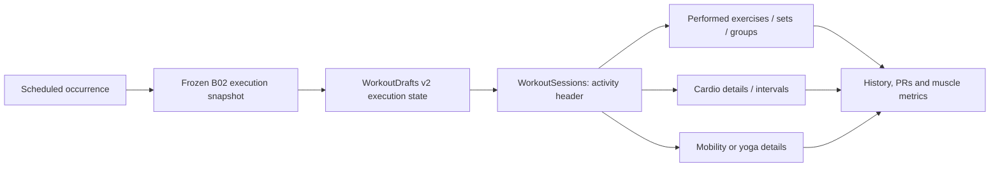

# B02 — Workout Execution and Modalities: Implementation Architecture

Status: implementation-ready proposal. `DECISIONS.md` is binding where it
differs. No application code is changed by this document.

## 1. Architecture summary

B02 turns the physical `WorkoutSessions` table into the canonical **activity
session** header; it does **not** create a second `ActivitySessions` table.
The existing session ID is already referenced by workout history,
`HealthProvenances`, scheduled-occurrence completion, backup, and UI. Keeping
that identity preserves B01 history and avoids an unsafe one-time ancestry
rewrite. A new `activityType` distinguishes new B02 strength, running,
cycling, walking, yoga, and mobility records from retained `legacy` rows.

The header owns common history facts: when the activity completed, duration,
source/provenance, scheduled-occurrence ancestry, immutable execution snapshot,
and completion kind. Modality detail is deliberately separate:

- Strength detail is the aggregate of `PerformedExercises`, `PerformedSets`,
  set segments, rest periods, target recommendations, and optional performed
  groups. It does not need a redundant 1:1 “strength details” row.
- `CardioSessionDetails` and `CardioIntervals` own cardio-only fields.
- `MobilitySessionDetails` owns yoga/mobility-only fields.

New B02 strength execution writes `Performed*` records, not duplicate
`WorkoutSets` rows. Retained `WorkoutSets` are a legacy historical projection.
Read repositories expose a deterministic union of legacy and B02 records until
all consumers have migrated; no dual writer or name-based backfill is allowed.

The existing `WorkoutDrafts` row remains the sole durable active-draft owner.
B02 adds a versioned execution-state payload to it. The frozen occurrence
snapshot and the draft state carry group position, substitutions, target and
warm-up recommendations, recorded work, and pending rest state. Finalization
remains owned by a narrow execution adapter in one transaction: insert the
activity header/details, complete the occurrence, append the idempotent event,
then delete the exact draft last.

The batch intentionally stops before B04. It may read a typed, optional sleep
or recovery observation as *unknown when absent*, but it neither calculates a
readiness score nor creates coaching recommendations.

## 2. Domain model and lifecycle

| Concept | B02 meaning | Durable owner |
|---|---|---|
| Scheduled occurrence | B01 calendar instance and state machine. It remains the only scheduled-workout owner. | `ScheduledSessionOccurrences` / `OccurrenceEvents` |
| Frozen prescription | Versioned snapshot at occurrence start. It contains activity type, B02 prescriptions, groups, user preference/equipment context and rule versions. | `executionSnapshotJson` |
| Activity session | Common immutable completed-history header. Physical table remains `WorkoutSessions`. | Drift |
| Strength detail | Performed groups, exercises, sets, set segments, rest periods and targets. | New `Performed*` tables |
| Cardio detail | A typed running/cycling/walking header plus optional explicit work/recovery intervals. | New cardio tables |
| Mobility/yoga detail | Typed practice details without distance/cardio assumptions. | New mobility table |
| Performed exercise | One actual exercise execution slot, including source prescription and explicit substitution. | `PerformedExercises` |
| Performed set | One actual warm-up or working-set attempt with target and actual facts kept distinct. | `PerformedSets` |
| Draft state | Resumable, mutable pre-finalization execution state only. | `WorkoutDrafts` v2 payload |
| Completed history | Immutable B02 records plus read-only B01 legacy projection. | Activity/history repositories |

### State rules

1. `planned`/`rescheduled` B01 occurrences start only through
   `CalendarRepository.start`; the snapshot is created once and never refrozen.
2. The B02 player only mutates the linked draft. It may change actual exercise,
   set, group progress, recommendations accepted/overridden, and pending rest;
   it never edits a published template or occurrence snapshot.
3. Completion inserts exactly one `WorkoutSessions` header for a scheduled
   occurrence, guarded by B01’s unique occurrence/session rule and event
   command ID. Full and partial completion use the existing B01 statuses and
   progression dispositions.
4. A completed B02 session is immutable in this batch. Manual activity is
   editable while a draft exists; completed manual/imported records are not
   silently edited or reclassified. A correction workflow is out of scope.
5. Historical B01 sessions retain their existing values. They migrate to
   `activityType=legacy`; their `WorkoutSets` remain valid legacy strength-like
   records. B02 does not infer cardio/yoga from their names or zero volume.

## 3. Ownership and repository boundaries

| Concern | Authoritative owner | Explicit non-owner |
|---|---|---|
| Session header and finalization | `ActivitySessionRepository` plus the scheduled execution coordinator | Player controller, progress UI |
| Occurrence state / idempotent event | `CalendarRepository` | Activity repository and widgets |
| Frozen snapshot and draft codec | `WorkoutExecutionCompatibilityAdapter` successor / `ExecutionDraftRepository` | Widgets and SharedPreferences |
| Group plan and group validation | `ProgramRepository` | Player state |
| Group execution position and substitutions | `StrengthExecutionRepository` + draft coordinator | Mutable program template |
| Performed exercises/sets/rest | `StrengthExecutionRepository` | `WorkoutRepository` legacy write path |
| Warm-up calculation | `WarmupRecommendationService` (pure, versioned) | UI calculations |
| Rest recommendation | `RestRecommendationService` (pure) and draft timer coordinator | Bottom sheet local state |
| Cardio and mobility records | `ActivitySessionRepository` with modality repositories | `HealthService` writing legacy sessions directly |
| Health provenance/import translation | `HealthActivityImportRepository` | Display-name checks |
| Muscle catalog/mappings | `ExerciseCatalogRepository` | Progress widgets |
| Muscle-volume read model | `MuscleVolumeRepository` | Session-total chart code |
| Load/repetition targets | `LoadTargetRecommendationService` (pure, versioned) | Player controller heuristics |

Riverpod owns route state, field editing, loading/error state and derived
read-model subscriptions. It owns no relational execution state. Existing
`WorkoutRepository` remains a legacy compatibility/query facade until each
consumer moves to the bounded owners above; it must not become a global
workout monolith.

## 4. Exercise groups

### Plan shape

An `ExerciseGroup` is an explicit ordered planning object. Its members refer to
exercise prescriptions by ID; the player never infers a group from display
names, adjacency, punctuation, or number of sets.

| Group type | Cardinality | Round rule | Default transition |
|---|---:|---|---|
| `superset` | exactly 2 members | Each member executes one prescribed working slot per round | no automatic rest between members |
| `circuit` | 2 or more members | Each member executes one prescribed working slot per round | no automatic rest between members |
| `giantSet` | 3 or more members | Each member executes one prescribed working slot per round | no automatic rest between members |

`roundCount` is shared by all members in the B02 MVP. A member needing a
different count belongs in a separate group or a standalone exercise; the
authoring UI must reject uneven group-round plans rather than pad them with
fake sets. A group may have its own rest after a complete round; a member may
have an explicit transition rest before the next member.

### Execution rules

- Player order is `group ordinal → round ordinal → member ordinal → set/segment`.
  Standalone prescriptions occupy an ordinal between groups and retain their
  normal set order.
- A substitution changes only the actual `PerformedExercise` in that frozen
  member slot. It records the original prescription, expected exercise ID/name
  snapshot, actual exercise ID/name snapshot, reason if supplied, and retains
  group/member/round position.
- A member can be skipped or partially recorded. The group is partial when any
  planned round/member slot is not completed. Partial group completion creates
  a B01 partial activity session; it does not mutate program membership.
- Draft resume restores the exact group, round, member, set/segment and pending
  rest position. It validates IDs against the frozen snapshot, not the current
  program graph.
- Reordering and removal are permitted only on a draft `ProgramVersion` before
  publication/occurrence start. Repository validation re-numbers contiguous
  ordinals transactionally. Published templates and started snapshots cannot be
  reordered or have a member removed; the execution alternative is explicit
  substitution or skip.
- History presents a group header with type, member order, completed rounds,
  actual substitutions and group rest. Legacy adjacent exercises are never
  retroactively displayed as a group.

## 5. Set technique model

B02 uses **composable attributes**, not a mutually exclusive “set type” enum.
`warmup` versus `working` is a set role. `standard`, `AMRAP`, and `toFailure`
are an effort intent. Tempo, paused reps, assistance, drops and rest-pause can
coexist when their field-level validation succeeds.

| Concern | Prescribed form | Performed form | Rule |
|---|---|---|---|
| Role | `setRole`: working | `setRole`: warmup or working | Warm-ups never contribute working volume. |
| Effort | `effortMode`: standard/amrap/toFailure | `effortMode`, `endedAtFailure` | AMRAP/failure retain actual reps. |
| Tempo | eccentric, bottom pause, concentric, lockout pause seconds | Same four actual/applied values | All four values are present when tempo is enabled; each is non-negative and not all zero. |
| Paused rep | position and seconds | position and seconds | Separate from tempo so a paused rep can be combined with tempo. |
| Assistance | mode and planned assistance | mode and actual assistance load | External load and assistance load are separate; never store a guessed “net load.” |
| Drop set | planned drop slots | actual ordered segments | A drop has at least two segments and at least one lower external load. |
| Rest-pause | maximum clusters/micro-rest | actual ordered segments/rest | At least two segments; each non-first cluster has an actual positive intra-set rest. |

`PerformedSetSegments` carries actual reps, external load, assistance load and
rest-before values. A normal set can use its header values with no segments;
drop/rest-pause work uses segments. A combination is legal: a segment may both
drop load and occur after a rest-pause interval. Header reps must equal the sum
of segment reps when segments are present.

Assistance is positive support in kilograms for a machine/counterweight/band/
partner/unknown mode. `externalLoadKg` is what is externally loaded, expressed
with explicit `loadBasis` (`totalExternal`, `perImplement`, `perSide`, or
`bodyweight`). The system does not subtract assistance, double dumbbells, or
estimate a one-rep maximum for assisted work.

## 6. Warm-up recommendation MVP

`WarmupRecommendationService` is deterministic, pure and non-medical. It
produces a proposed ramp from the frozen selected working target. It stores its
rule version, inputs/completeness flags and proposed set plan in the B02 draft;
actual warm-up sets are normal `PerformedSets` with role `warmup`.

1. Choose a working load in this order: explicit user-edited target in the
   draft, load-target recommendation, explicit strength-set prescription,
   recent comparable working load. If none exists, emit `unavailable` with a
   manual warm-up affordance; never invent 20 kg.
2. Use user `warmupPreference` (`off`, `ask`, `automatic`) and requested ramp
   count, clamped to 1–4. Default automatic count is 3.
3. Percentage stages are deterministic: 1 = `[50]`; 2 = `[40, 70]`; 3 =
   `[40, 60, 80]`; 4 = `[30, 45, 60, 80]`. Proposed reps are respectively
   `[5]`, `[5, 3]`, `[5, 3, 2]`, `[6, 4, 3, 2]`.
4. Resolve an increment from the frozen effective `EquipmentProfileItem`, then
   its profile default. Round each stage to the nearest supported increment,
   never above the working target; collapse duplicate stages after rounding.
   If no positive increment is known, retain a one-decimal unrounded value and
   mark `incrementUnavailable` rather than pretending equipment support.
5. For `bodyweight`, show one optional technique-preparation set of 5–10 reps
   with no invented external load. For a very light target where stages collapse
   to the working value, retain at most one lower positive rounded stage; if
   none exists, return “working load is already light” and no ramp.
6. `loadBasis` is frozen and displayed. Per-dumbbell/per-side values are never
   doubled; machine values use the matched machine increment. The user can edit,
   delete or add every recommended warm-up set. Edits change only the draft and
   the resulting actual performed sets.

Any malformed target, negative/zero increment, missing equipment mapping or
unsupported basis produces a safe non-blocking fallback and a visible reason.

## 7. Rest architecture and precedence

Rest has a recommendation, a selected duration, a source, and an actual
elapsed duration. A `PerformedRestPeriod` is created in the draft when rest
begins and finalizes when the next execution action begins, the timer ends, or
the user skips it. It is immutable after activity completion.

### Context-specific precedence

| Context | Selected duration precedence, highest first | Automatic fallback |
|---|---|---|
| Rest-pause cluster | user change for this cluster → prescribed rest-pause seconds | none; no generic exercise timer |
| Between group members | user change for this transition → member transition rest → 0 seconds | none |
| After a group round | user change for this rest → group rest-after-round → template default | automatic rule → 90 seconds |
| Standalone/exercise set | user change for this rest → strength-set prescription → per-exercise user preference → template default | automatic rule → 90 seconds |

The automatic rule runs only when no explicit value above exists. It returns a
recommendation and explanation (for example, RPE band, effort mode, group
context, or fallback), never a silent override. Its B02 MVP bounds are 45–240
seconds: default 90, RPE 9–10/failure +30, RPE 6–7 −15, AMRAP +15, clamped to
the range. Missing RPE leaves the default unchanged. These are configurable
rule constants with a version and require Sol approval; they are not recovery
or medical advice.

The timer starts from wall-clock time, persists `startedAtUtc` in the draft,
recomputes remaining time after app resume, supports accessible `+30 seconds`,
custom duration and skip, and never prevents the next set from being logged.
Notifications/vibration are optional platform effects, not the source of truth.

## 8. Typed activity modalities

| Modality | Required at completion | Optional | Source / duplicate / edit behavior | History presentation |
|---|---|---|---|---|
| Strength | duration plus at least one performed set for a non-empty completion | RPE, notes, targets, groups, rest, technique fields | Manual/scheduled only in B02; editable only in draft | Group/exercise/set summary and target comparison |
| Running | duration | distance, pace/speed, incline, elevation, HR, intensity, intervals | Manual or exact provider mapping; provenance external ID/fingerprint rejects duplicates | Run badge, duration/distance/pace, interval summary/source |
| Cycling | duration | distance, speed, elevation, HR, intensity, intervals | Manual or exact provider mapping; same duplicate rule | Cycle badge, duration/distance/speed/elevation/source |
| Walking | duration | distance, pace/speed, incline/elevation, HR, intensity, intervals | Manual or exact provider mapping; same duplicate rule | Walk badge, duration/distance/pace/source |
| Interval cardio | base modality plus duration; at least one work interval | recovery intervals, distance/HR/intensity per segment | Manual or exact provider mapping when provider exposes segments | Base-modality badge and ordered work/recovery timeline |
| Yoga | duration | style, intensity, focus note, HR | Manual; health import only when a provider supplies an exact reviewed yoga type | Yoga badge, duration/style/intensity/focus |
| Mobility | duration | focus note, intensity, HR | Manual; same exact-mapping condition for import | Mobility badge, duration/intensity/focus |

`CardioSessionDetails` stores observed fields; pace/speed may be derived for
display when distance and duration exist, but a provider/manual observed value
is retained separately. `CardioIntervals` stores ordered work/recovery
segments. Yoga and mobility use `MobilitySessionDetails`, not distance rows or
strength-set rows. Health adapters map provider enum/API types through a
reviewed mapping table in code; unknown values are not imported. Existing
substring detection and “export everything as strength” are removed only when
the typed path is live.

## 9. Muscle mapping and volume semantics

The canonical taxonomy is a versioned, stable-ID `Muscles` catalog with a
region and display name. `ExerciseMuscleMappings` joins a stable exercise ID
to a muscle with `role`, `contributionBasisPoints`, `mappingStatus`, source and
catalog version. B02 imports only reviewed mapping data; it does not derive
weights from `Exercises.muscleGroups`, and it does not fuzzy-map custom or
legacy exercises. A custom exercise without a reviewed mapping is explicitly
`unknown`.

### Metric definitions

- A **working set** is a `PerformedSet` with role `working` and at least one
  performed repetition. It contributes one working-set unit, regardless of
  being in a group. Warm-ups contribute zero. A legacy set is reported in a
  separate legacy coverage category until its role is known.
- A **completed effective-set unit** is a mechanical completion ratio, not a
  physiological claim: actual total reps divided by the target minimum reps,
  capped at 1.0. It is null, not zero, when no target exists. A complete
  working set with no target remains countable as a working set but has no
  effective-set value.
- Drop and rest-pause segments belong to one set slot; they do not create extra
  working-set units. Their total segment reps are used for that set’s
  completion ratio. AMRAP/failure may reach 1.0 but does not exceed it.
- Assisted work is counted as a working set when performed, labelled assisted,
  and never converted to an invented net load. Partial work uses its observed
  completion ratio when a target exists.
- Group membership does not multiply volume. Each member set is allocated once.
  `allocatedWorkingSetUnits = 1 × contributionBasisPoints / 10000`; the same
  allocation applies to a non-null effective unit.
- Any unknown/unreviewed mapping produces an explicit unallocated bucket and
  mapping-coverage ratio. Heat maps and weekly summaries must show unknown/
  incomplete data rather than rendering it as zero.

Mappings and actual performed facts are stored. Daily/weekly muscle volume,
heat-map cells, coverage and group summaries are derived read models; no
mutable aggregate table becomes another authority.

## 10. Explainable load and repetition targets

`LoadTargetRecommendationService` is a pure, versioned B02 rule engine.
Every output is an optional recommendation, not a command. It writes a draft
recommendation and freezes it into the final performed exercise/set evidence
so history can explain what was shown even after later rule changes.

### B02 rule v1

1. Comparator eligibility requires the same resolved stable exercise ID and
   `loadBasis`, a working set with reps, and completion within the last 12
   weeks. It excludes warm-ups and unresolved/name-only rows. A substitution
   uses the replacement exercise’s own history; it never borrows the original
   exercise’s history without an explicit future equivalence feature.
2. Select the most recent comparable set in the prescribed rep range; otherwise
   select the most recent eligible working set and mark the range incomplete.
3. If actual reps reach/exceed the maximum and RPE is 8 or lower, increase by
   one resolved equipment increment. If reps are below the minimum or the set
   ended at failure before the minimum, decrease one increment. Otherwise keep
   the comparable load. Never produce a negative load or an increase larger
   than one increment in one recommendation.
4. The proposed rep target is the prescription range. Where no range is
   available, preserve the previous achieved reps as a displayed starting point
   and mark target completeness insufficient; do not manufacture a range.
5. In an explicit B01 deload week, reduce a resolved load target to 90%, then
   round to the applicable increment, with `deload-v1` in evidence. If there is
   no resolved target/increment, suppress automatic load change and explain why.
6. Recent workload is the count of eligible working-set units in the preceding
   seven civil days in the execution timezone. B02 v1 records it as an evidence
   and completeness input only; it does not numerically change load. Missing
   sleep/recovery is likewise unknown and can lower confidence/completeness
   only, never change load.
7. A new exercise with an explicit prescribed load can use it at low confidence.
   With neither a prescription nor a comparable set, return no load target and
   request manual entry.

Output fields are: recommended load/basis, rep min/max, optional target RPE,
confidence (`high`, `medium`, `low`, `insufficient`), completeness flags,
algorithm version, evidence cutoff, comparator count, increment used, rationale
codes and a user-override flag. The UI states the main reasons in plain
language. Manual changes remain in the draft and actual performed fields;
they do not overwrite the recommendation or retrain the rule. Rule constants,
deload factor and comparator safety require **SOL-GATE REQUIRED** approval.

## 11. Proposed schema (v16) and validation

All text IDs below are app-generated UUIDs unless a table explicitly keeps the
existing integer session ID. New user-owned records participate in Backup v7.

### Existing-table extensions

| Table | Purpose | Primary key | Important fields | Foreign keys | Indexes |
|---|---|---|---|---|---|
| `WorkoutSessions` | Common activity header, retaining B01 identity | existing `id` | `activityType` (`legacy`, `strength`, `running`, `cycling`, `walking`, `yoga`, `mobility`), `activitySchemaVersion` | existing occurrence FK | `(activity_type, completed_at)`; retain unique occurrence index |
| `SessionTemplates` | Typed scheduled template | existing `id` | `activityType`, `defaultRestSeconds` | existing week FK | `(program_week_id, activity_type, ordinal)` |
| `WorkoutDrafts` | B02 resumable activity draft | existing `id` | `activityType`, `executionStateJson`; retain v1 fields and `draftSchemaVersion` | existing occurrence FK | retain occurrence draft index |
| `ExerciseUserPreferences` | Per-identity execution preferences | existing `id` | `warmupPreference`, `warmupSetCount`, `customRestSeconds` | stable exercise FK/fallback key | retain unique identity key |

`WorkoutSets`, `RoutineExercises`, and B01 snapshot columns are not removed or
repurposed. B02 reads them only through legacy compatibility adapters.

### New tables

| Table | Purpose | Primary key | Important fields | Foreign keys | Indexes |
|---|---|---|---|---|---|
| `ExerciseGroups` | Ordered plan-level group | `id` | `sessionTemplateId`, `ordinal`, `groupType`, `roundCount`, `restAfterRoundSeconds`, `label` | template | unique `(sessionTemplateId, ordinal)` |
| `ExerciseGroupMembers` | Ordered membership of prescribed exercises | `id` | `exerciseGroupId`, `exercisePrescriptionId`, `ordinal`, `transitionRestSeconds` | group, prescription | unique group/ordinal and unique prescription |
| `StrengthSetPrescriptions` | Canonical B02 strength target and technique plan | `id` | prescription ID, ordinal, `targetLoadKg`, `loadBasis`, reps min/max, RPE, rest, effort, tempo components, paused-rep, assistance, drop/rest-pause plan | exercise prescription | unique `(exercisePrescriptionId, ordinal)` |
| `CardioSessionDetails` | Cardio-specific activity facts | `sessionId` | distance metres, observed pace/speed, incline, elevation, HR, intensity, `isIntervalWorkout`, input mode | session | `(is_interval_workout)` |
| `CardioIntervals` | Ordered work/recovery segments | `id` | cardio session ID, ordinal, `segmentType`, duration, distance, pace/speed, HR, intensity | cardio details | unique `(cardio_session_id, ordinal)` |
| `MobilitySessionDetails` | Yoga/mobility facts | `sessionId` | `practiceType`, style, intensity, focus note, average HR | session | `(practice_type)` |
| `PerformedExerciseGroups` | Immutable group history header | `id` | session ID, source group ID, type/label snapshot, ordinal, planned/completed rounds, status | session, optional source group | unique `(session_id, ordinal)` |
| `PerformedExercises` | Actual exercise slot and substitution provenance | `id` | session ID, group ID/member ordinal/round, source prescription ID, expected and actual exercise IDs/name snapshots, status, substitution reason | session, optional performed group, prescription, stable IDs | `(session_id, ordinal)`, `(actual_exercise_id, session_id)`, source prescription |
| `ExerciseTargetRecommendations` | Frozen offered target and rationale | `id` | performed exercise ID, rule version, confidence/completeness, load/basis, reps/RPE, increment, evidence cutoff/count, rationale codes, override flag | performed exercise | unique performed exercise; rule/version |
| `PerformedSets` | Actual warm-up/working set with target and outcome | `id` | performed exercise ID, ordinal, role, target load/reps/RPE, actual load/basis/reps/RPE, effort, failure, tempo, pause, assistance, notes | performed exercise | unique `(performed_exercise_id, ordinal)`; role |
| `PerformedSetSegments` | Actual drop/rest-pause sequence | `id` | performed set ID, ordinal, reps, external load/basis, assistance, rest-before seconds | performed set | unique `(performed_set_id, ordinal)` |
| `PerformedRestPeriods` | Selected and actual rest history | `id` | session ID, optional set/group, scope, recommended/selected/actual seconds, source, start/end UTC, end reason | session, optional set/group | session/start; set; group |
| `Muscles` | Reviewed taxonomy | stable text `id` | display name, region, catalog version, active flag | none | unique display/catalog version |
| `ExerciseMuscleMappings` | Reviewed allocation mapping | `id` | exercise stable ID, muscle ID, role, contribution basis points, mapping status/source/catalog version | exercise, muscle | unique exercise/muscle; muscle/status |

Repository validators, not widgets, enforce: legal activity/detail pairing;
non-negative duration/distance/load; one cardio or mobility detail for its
matching activity type; required cardio duration and interval work segment;
group cardinality and contiguous ordinals; target rep min ≤ max; tempo
completeness; segment totals; valid assistance; rest scope; reviewed mapping
allocation summing to 10,000 basis points for volume-eligible mappings; and no
reference to an unresolvable exercise identity where a B02 write requires one.

## 12. Migration, draft, and backup strategy

### Database v15 → v16

The migration runs in one explicit transaction. It adds the four existing-table
extensions, creates B02 tables/indexes/constraints, and leaves all B01/legacy
rows intact. Existing `WorkoutSessions` receive `activityType=legacy`; no
historical session is classified from a title, set fields, source name or
substring. Existing `WorkoutSets` are not copied to `PerformedSets` because
target, technique, group, rest and substitution facts cannot be recovered.

Existing v1 drafts remain valid and decode through the legacy codec path.
They are not rewritten during migration. A B02 v2 start creates
`executionStateJson`; a resumed v1 draft may finish only through the legacy
compatibility path or explicitly discard/restart. No migration invents a group,
modality, mapping allocation, target, rest or assistance value.

### Backup v6 → v7

Backup v7 adds typed collections for every B02 table plus the new fields on
existing tables. It prevalidates the entire graph before mutation. v5/v6
imports accept absent B02 collections, restore B01 rows unchanged, set restored
sessions to `legacy`, and create no B02 detail/mapping records. Future backup
versions fail closed.

Restore insertion order is: seeded catalog/custom exercises → muscles and
mappings → program graph → groups/member/set prescriptions → activity headers
→ modality details/performed group/exercise/set/segment/rest/target rows →
drafts → health provenance. Deletion order is exact reverse FK order. Restore
must preserve the B01 transaction/SharedPreferences compensation behavior.

## 13. MVP UX journeys and states

| Journey | MVP flow |
|---|---|
| Create grouped exercises | In draft program editing, select ordered prescriptions, choose type and rounds, configure group/rest/member transition values, review validation, then publish. No grouping edit on published versions. |
| Execute group | Player announces group/type/round, renders one member at a time, records a slot, offers only applicable transition/group rest, then persists draft position. Substitution and skip act on the current member slot. |
| Add technique | Set editor starts with role/effort, exposes an “advanced details” disclosure for tempo, pause, assistance, drops and rest-pause segments, and validates combinations before saving. |
| Review warm-up | Before first working set, show proposed ramp, source/reason and equipment rounding; accept, edit, skip or add manual warm-ups. |
| Override rest | Timer shows selected duration and source, allows accessible custom duration/+30/skip, and records actual elapsed time without blocking logging. |
| Log interval cardio | Select run/cycle/walk, enter duration and optional aggregate facts, add ordered work/recovery segments, preview total and save a typed draft/session. |
| Log yoga/mobility | Select yoga or mobility, enter duration and optional style/intensity/focus/HR; no distance or strength-set controls appear. |
| View muscle heat map | Show date range, allocation metric, mapping coverage and an explicit unknown bucket. Empty data states say no reviewed mapped working sets yet. |
| Review load target | Show target, confidence, comparison summary, rule version/reasons, and editable values. “No target yet” explains missing comparable/prescription data. |

Every flow needs: loading skeleton/disabled duplicate submit; empty explanatory
state; partial completion state and recovery; actionable validation/error state;
offline-first operation with no network dependency; and semantic labels,
44×44 targets, screen-reader order, text scaling, color-independent state and
compact-screen scrolling. Health import additionally needs permission-denied,
provider-unavailable, duplicate-suppressed and unknown-type states.

## 14. Test matrix

| Area | Unit / repository | Database / migration / backup | Controller / widget / integration | Platform/manual |
|---|---|---|---|---|
| Activity header/modalities | type validators, required-field rules, history union | v15→v16 legacy rows; detail pairing; v5/v6 restore | manual cardio/yoga/mobility draft→summary→history | Health permission and provider records |
| Groups | cardinality/order/reorder validator | group/member FK and snapshot persistence | round/member resume, substitute/skip/partial, history display | compact player traversal |
| Techniques | tempo/assistance/segment validation | segment sums and backup round trip | advanced editor/draft restoration | input accessibility |
| Warm-ups | stage/rounding/fallback determinism | v1/v2 draft compatibility | accept/edit/skip/restart flows | pair/per-hand/machine display review |
| Rest | precedence and actual-elapsed calculation | rest FK/backup round trip | timer background/resume/skip/+30/group contexts | notification/vibration permission |
| Targets | comparator, bounds, deload, unknown data | final evidence survives backup | explain/override/substitution UI | no recovery score behavior |
| Muscle volume | allocation/coverage/effective-unit rules | mapping constraints/migration/backup | range/filter/unknown heatmap states | color-blind and text-scale review |
| Health import | exact provider mapping/fingerprint duplicate rules | provenance linkage/restore | import state and typed history | Android Health Connect and iOS HealthKit matrix |
| Finalization | command retry and rollback | no duplicate session/details/event/draft deletion order | full/partial/early-finish journey | release builds and offline kill/resume |

The ordered implementation and exact acceptance/validation commands are in
`TASKS.md`; all high-risk semantic and data-integrity work is gated in
`DECISIONS.md`.

## 15. B02 definition of done

B02 is complete only when all of the following are evidenced in the final Sol
verification:

- B01 history, scheduled occurrence state, v1 drafts, and v5/v6 backups remain
  usable without inferred modality/group/mapping data.
- New strength execution supports explicit groups, composable techniques,
  substitution, full/partial completion and draft resume with retry-safe
  finalization.
- Warm-up, rest and target recommendations are deterministic, explainable,
  overridable and persist offered-versus-actual facts without B04 readiness.
- Running, cycling, walking, intervals, yoga and mobility have typed records,
  modality-correct history and reviewed Health import/export behavior.
- Muscle heat maps and weekly summaries use reviewed mappings, explicit
  allocation/coverage, warm-up exclusion and unknown-not-zero presentation.
- Schema v15→v16, backup v5/v6 import and v7 round-trip/rollback tests pass for
  every user-owned B02 record.
- All task acceptance tests, static analysis, Android/iOS release builds,
  offline kill/resume, Health permission/provider checks, compact-screen and
  accessibility checks pass; all Sol gates and product decisions are recorded.
