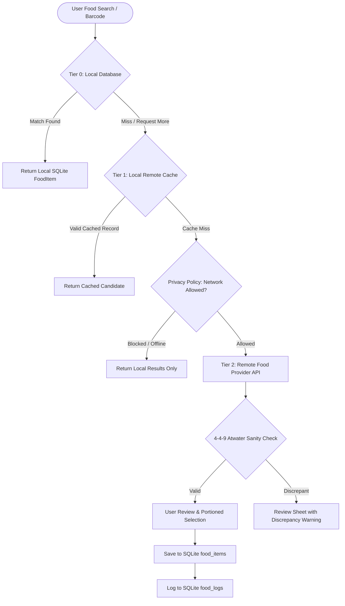

# Multi-Provider Food Catalog & Provenance Specification (PV1-CATALOG-01A)

**Author:** IndiFit Core Architecture  
**Status:** Frozen / Approved  
**Milestone:** Connected Track — PV1-CATALOG-01A  
**Branch:** `codex/post-v1-net-01-capability-boundary`  

---

## 1. Executive Summary & Problem Context

Accurate nutrition logging in India presents unique challenges that traditional Western nutrition APIs (such as FatSecret, Nutritionix, or USDA FoodData) fail to solve:
1. **Cooked Dishes vs Packaged Goods:** The majority of daily Indian caloric intake comes from freshly cooked home meals (e.g., *Dal Tadka*, *Roti*, *Sabzi*, *Khichdi*, *Sambar*, *Poha*), where portion sizes are estimated in colloquial culinary units (*katori*, *piece*, *bowl*, *spoon*) rather than precise gram scales.
2. **Packaged FMCG Barcode Scarcity:** Packaged items (e.g., *Amul Taaza Milk*, *Britannia Nutrichoice*, *Haldiram's Bhujia*, *Tata Sampann Dal*) require barcode lookup. Crowdsourced databases have high coverage for Indian barcodes but suffer from wildly erroneous user-uploaded macronutrient data.
3. **No Silent Promotion Invariant:** In IndiFit, unverified external API responses must **never** be injected directly into historical user logs (`food_logs`). External items must be previewed, reviewed, and saved to the local SQLite database as canonical items before logging.

---

## 2. Food Provider Evaluation Matrix

| Criterion | ICMR-NIN IFCT 2017 | Open Food Facts (OFF) India | USDA FoodData Central | IndiFit Cloud Curated |
| :--- | :--- | :--- | :--- | :--- |
| **Primary Domain** | Raw Indian ingredients & standard cooked recipes | Packaged groceries & barcodes | Western raw & packaged foods | Curated Indian home meals & fitness staples |
| **Indian Barcode Coverage** | None (academic compendium) | **High (80,000+ Indian SKUs)** | Minimal | Moderate (curated popular items) |
| **Cooked Indian Dish Quality** | **Gold Standard (ICMR-NIN lab tested)** | Poor (high user variance) | Irrelevant | High (verified standardized recipes) |
| **Serving Units** | 100g standard basis | Grams / arbitrary pack sizes | Grams / ounces | **Colloquial (katori, piece, bowl, glass)** |
| **Data Integrity / Accuracy** | Certified scientific laboratory data | Variable (crowdsourced errors) | High (lab tested) | Verified with 4-4-9 Atwater checks |
| **Licensing** | Government Open Data / Research | **ODbL (Open Database License)** | Public Domain (US Gov) | Proprietary / IndiFit Community |
| **Offline Capability** | Bundled in app (100% offline) | Requires network / cached | Requires network | Cached locally in SQLite |
| **Attribution Requirement** | ICMR-NIN citation | Mandatory ODbL & OFF attribution | Recommended | IndiFit attribution |

---

## 3. Tiered Resolution Architecture

To deliver instant search performance with zero network latency while providing access to millions of packaged products, IndiFit employs a 3-tier lookup hierarchy:



### Invariants:
1. **Tier 0 (Local Database):** Queries `food_items` and user custom foods first. Returns synchronously without network dependency.
2. **Tier 1 (Local Remote Cache):** Queries `remote_food_cache` with a 14-day freshness TTL. If offline, stale cache is returned with an "Offline Cached" indicator.
3. **Tier 2 (Live Remote Search):** Queried only when the user explicitly requests more online results or scans an unknown barcode.
4. **No Direct Log Write:** Remote candidate payloads are converted into a `FoodItem` entity, saved to local SQLite, and assigned a canonical local integer `id` before any `food_log` record can reference it.

---

## 4. Normalized Remote Food Schema (`RemoteFoodCandidate`)

All external provider responses must parse into the typed `RemoteFoodCandidate` envelope:

```json
{
  "id": "off_8901030383704",
  "provider": "openFoodFacts",
  "providerId": "8901030383704",
  "name": "Amul Taaza Homogenised Toned Milk",
  "nameHindi": "अमूल ताज़ा टोन्ड दूध",
  "brand": "Amul",
  "barcode": "8901030383704",
  "category": "dairy",
  "caloriesPer100g": 58.0,
  "proteinPer100g": 3.0,
  "carbsPer100g": 4.7,
  "fatPer100g": 3.0,
  "fiberPer100g": 0.0,
  "servingOptions": [
    {
      "unitName": "ml",
      "gramWeight": 1.03,
      "isDefault": false
    },
    {
      "unitName": "glass",
      "gramWeight": 206.0,
      "isDefault": true
    },
    {
      "unitName": "cup",
      "gramWeight": 154.5,
      "isDefault": false
    }
  ],
  "provenance": {
    "provider": "openFoodFacts",
    "attributionText": "Data sourced from Open Food Facts under the Open Database License (ODbL).",
    "license": "ODbL",
    "sourceUrl": "https://world.openfoodfacts.org/product/8901030383704",
    "fetchedAtUtc": "2026-09-03T10:00:00Z"
  },
  "verificationLevel": "communityReported"
}
```

---

## 5. Indian Culinary Serving Units & Conversions

Standard Western units ("1 slice", "1 cup") are ambiguous for Indian cuisine. IndiFit standardizes reference gram weights for colloquial units:

| Unit Name | Hindi Transliteration | Standard Gram Weight | Common Dish Applicability |
| :--- | :--- | :--- | :--- |
| `katori` | कटोरी (Standard small bowl) | 150 g | Dal, Kadhi, Sabzi, Raita, Khichdi |
| `medium_katori` | मध्यम कटोरी | 200 g | Curries, Biryani, Pulao |
| `roti_piece` | रोटी / चपाती (6 inch) | 35 g | Phulka, Whole Wheat Roti |
| `paratha_piece` | परांठा (plain) | 60 g | Plain Triangle Paratha |
| `stuffed_paratha` | भरवां परांठा (Aloo/Paneer) | 110 g | Stuffed Paratha |
| `idli_piece` | इडली (medium) | 40 g | Steamed Rice/Urad Idli |
| `dosa_piece` | सादा डोसा | 90 g | Plain Crisp Dosa |
| `serving_bowl` | बड़ा कटोरा | 300 g | Salads, Rice dishes |
| `tablespoon` | बड़ा चम्मच | 15 g | Ghee, Oil, Chutney, Sugar |
| `teaspoon` | छोटा चम्मच | 5 g | Honey, Seeds, Oil |
| `glass` | गिलास | 200 ml | Milk, Chaas, Lassi, Juice |

---

## 6. Atwater 4-4-9 Macro Sanity Validation

Crowdsourced databases frequently contain inverted or typo-ridden macros (e.g. 1000 kcal with 2g protein and 0g fat). Before presenting candidates, IndiFit computes expected calories:

$$\text{Expected Kcal} = 4 \times \text{Protein(g)} + 4 \times \text{Carbs(g)} + 9 \times \text{Fat(g)}$$

### Decision Rules:
1. **Plausible:** If $|\text{Reported Kcal} - \text{Expected Kcal}| \le \max(15, 0.20 \times \text{Reported Kcal})$, mark `isMacroBalanced = true`.
2. **Discrepant:** If discrepancy exceeds 20%, mark `isMacroBalanced = false` and display a warning banner in the review dialog allowing the user to override or correct the macros.
3. **Impossible:** If $\text{Protein} + \text{Carbs} + \text{Fat} + \text{Fiber} > 105\,\text{g}$ per 100g, mark `isPhysicallyPossible = false` and require manual correction.

---

## 7. Licensing & Attribution Contract

To strictly comply with the Open Database License (ODbL) and third-party terms:
1. **Attribution Display:** Any product sourced from Open Food Facts must display:  
   *"Source: Open Food Facts (ODbL)"* with a clickable link in the food detail review sheet.
2. **No Data Tainting:** Local proprietary user recipe formulations and personal log history remain private and are not uploaded or contributed back without explicit user opt-in.
3. **Fair Use / Rate Limiting:** All remote requests must carry a distinct `User-Agent: IndiFit/1.0.0 (https://indifit.app)` header and respect standard HTTP 429 backoff headers.
