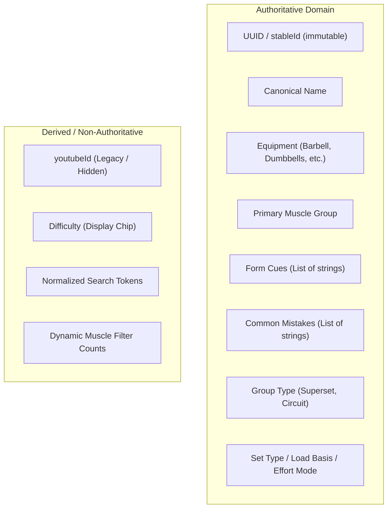
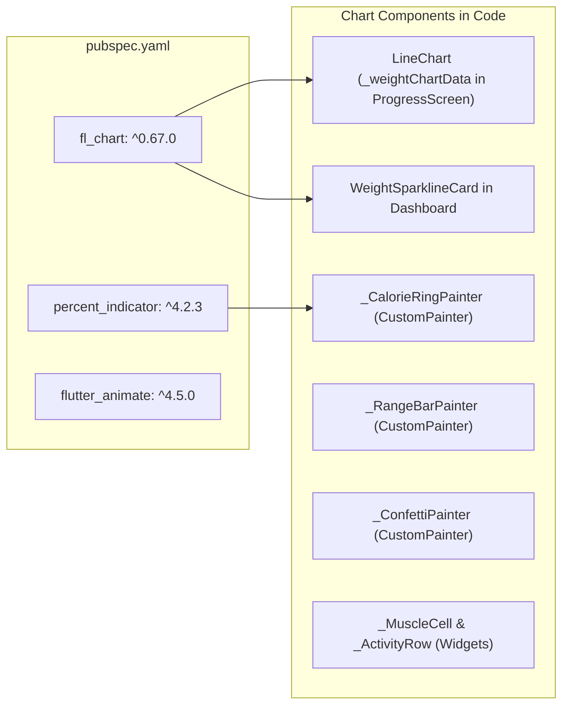
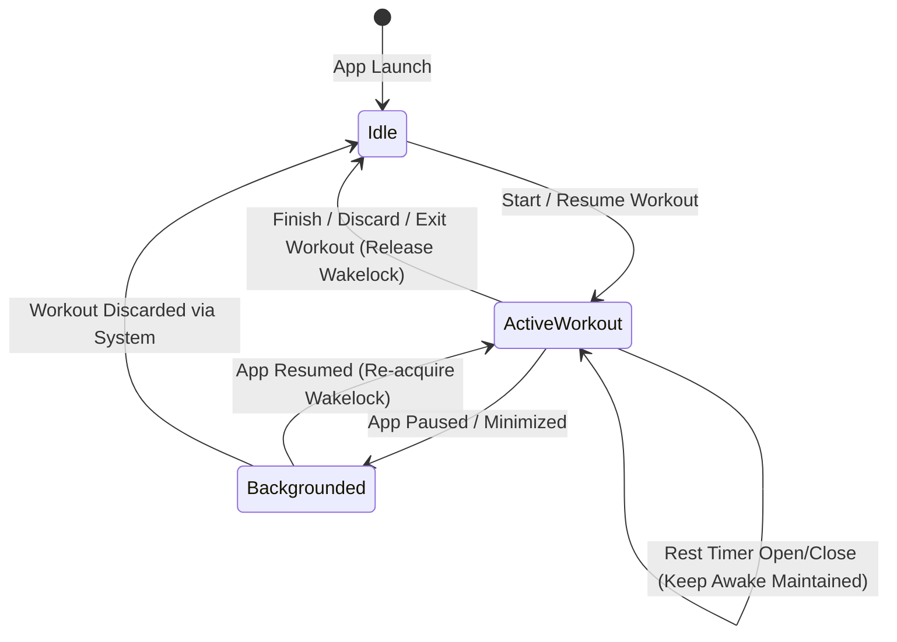
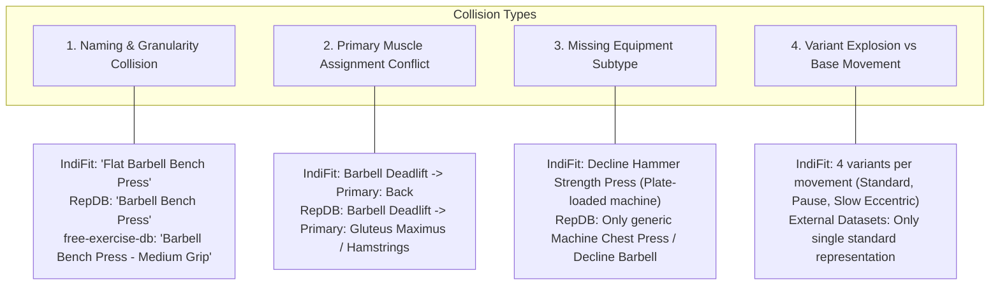
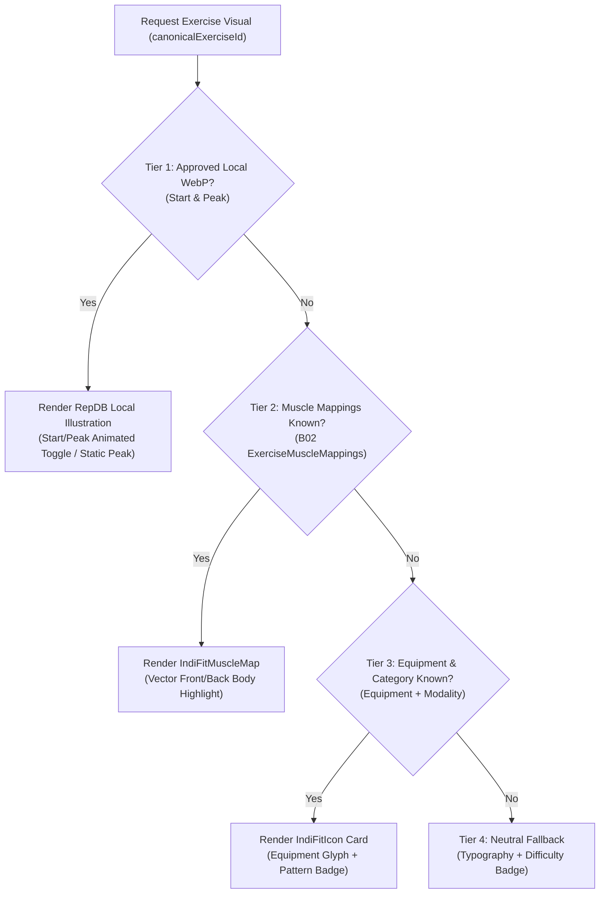
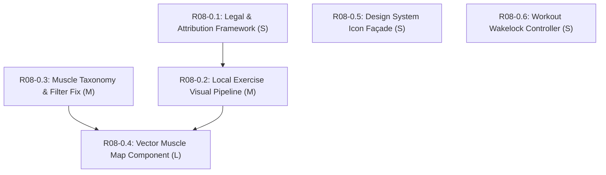

# R08-0 External Asset & Visual Foundation Readiness Audit

**Document Version:** 1.0.0 (Frozen Pre-Implementation Audit)  
**Date:** 2026-08-20  
**Scope:** Read-Only Audit of Current IndiFit Repository (`indifit/`) vs. External Open-Source Resources for the R08 Redesign Foundation.  
**Authoritative Reference:** [IndiFit Product Audit & Redesign Reference Manual (Frozen)](file:///Users/dankmagician/Documents/New%20project/indifit/docs/reference/ui/REFERENCE_GUIDE.md)

---

## Executive Summary

IndiFit has completed substantial domain engineering across Batches B01–B05 (Programs, Workout Execution, Nutrition, Adaptive Coaching, and UI Personalization Foundations). However, exercise discovery, workout execution, and progress tracking remain heavily text-based. The R08 redesign aims to introduce a robust, offline-first visual asset foundation (exercise illustrations, vector muscle heatmaps, refined iconography, and lifecycle screen management).

This audit rigorously evaluated the readiness of the current repository against 10 external open-source candidate resources.

### Key Audit Findings

1. **Exercise Domain Readiness:**  
   IndiFit has a rock-solid, deterministic catalog architecture with **140 catalog variants across 35 canonical base movements** managed via immutable golden UUIDs in [ExerciseCatalogManifest](file:///Users/dankmagician/Documents/New%20project/indifit/lib/core/fixtures/exercise_identity_fixtures.dart#L82-L256), [assets/data/exercises.json](file:///Users/dankmagician/Documents/New%20project/indifit/assets/data/exercises.json), and the Drift [Exercises](file:///Users/dankmagician/Documents/New%20project/indifit/lib/data/database/tables/workout_tables.dart#L3-L21) table.
2. **RepDB Alignment (34 of 35 mapped):**  
   The **RepDB Free Tier snapshot** (250 exercises, 512px flat WebP illustrations) provides an almost perfect visual fit. 34 of IndiFit's 35 base movements have high-confidence matches (27 EXACT, 7 STRONG, 1 NO MATCH: *Decline Hammer Strength Press*). Bundling start+peak illustrations for all 35 canonical movements adds only **~1.4 MB** to the asset bundle.
3. **Muscle Taxonomy Defect in Current UI:**  
   The current [ExerciseLibraryScreen](file:///Users/dankmagician/Documents/New%20project/indifit/lib/features/exercise_library/exercise_library_screen.dart#L85-L100) performs naive substring matching (`contains`) on comma-separated `muscleGroups`, allowing secondary muscles to flood primary browsing (e.g. *Flat Barbell Bench Press* appears when browsing *Triceps*). This directly violates the frozen product rule: *PRIMARY muscle determines browsing category; secondary muscles are informational*.
4. **Muscle Map & Anatomy Rendering:**  
   B02 volume models ([B02MuscleVolumeReadModel](file:///Users/dankmagician/Documents/New%20project/indifit/lib/data/models/b02_muscle_volume_models.dart#L229-L325)) and B05 registry contracts ([B05MuscleVisualRegistry](file:///Users/dankmagician/Documents/New%20project/indifit/lib/core/fixtures/b05_foundation_registry.dart#L388-L442)) exist, but currently render as text chips in [b02_progress_widgets.dart](file:///Users/dankmagician/Documents/New%20project/indifit/lib/features/progress/b02_progress_widgets.dart#L300-L323). Porting vector paths from MIT-licensed **MuscleMap** to a pure Flutter `CustomPainter` (`IndiFitMuscleMap`) is fully feasible and eliminates any runtime API dependency.
5. **Icon & Chart Infrastructure:**  
   `fl_chart: ^0.67.0` is already in [pubspec.yaml](file:///Users/dankmagician/Documents/New%20project/indifit/pubspec.yaml#L40) and fully capable of all required sparklines, volume bars, and weight trends. No new charting dependency is required. Icons currently rely on scattered Material `Icons.*`; introducing a domain facade `IndiFitIcons` (wrapping Material + selective Phosphor glyphs) solves consistency without sweeping churn.
6. **Wakelock & Screen-Awake:**  
   `wakelock_plus: ^1.1.4` is already in [pubspec.yaml](file:///Users/dankmagician/Documents/New%20project/indifit/pubspec.yaml#L46), but is currently invoked *only* during the rest timer modal ([rest_timer_bottom_sheet.dart](file:///Users/dankmagician/Documents/New%20project/indifit/lib/features/workout_player/widgets/rest_timer_bottom_sheet.dart#L17-L26)). It must be extended to the active workout session lifecycle.
7. **Wave Sizing:**  
   **R08-0 is a MEDIUM (M) foundation wave**, broken into 6 parallelizable work packages (`R08-0.1` through `R08-0.6`).

---

## Evidence Categorization Key

To ensure complete analytical rigor, all statements in this audit are tagged with one of four evidence classifications:

- `[VERIFIED CURRENT REPO FACT]`: Directly confirmed by static inspection of code, schemas, manifests, or fixtures in `indifit/`.
- `[EXTERNAL SOURCE FACT]`: Verified from upstream repository licenses, documentation, files, or snapshots.
- `[INFERENCE]`: Logical deduction derived by combining current code architecture with external specifications.
- `[RECOMMENDATION]`: Specific proposed architectural decision or task definition for R08.

---

## Part 1 — Current IndiFit Exercise Inventory

### 1. Model, Entity & Table Architecture

| Entity / Symbol | File Path | Role | Authority |
|---|---|---|---|
| `Exercises` (Table) | [lib/data/database/tables/workout_tables.dart](file:///Users/dankmagician/Documents/New%20project/indifit/lib/data/database/tables/workout_tables.dart#L3-L21) | Drift SQL Table: `id` (int PK), `stableId` (UUID string), `name`, `muscleGroups`, `equipment`, `difficulty`, `formCues`, `commonMistakes`, `youtubeId`, `isCustom` | Canonical Local DB |
| `Exercise` (DataClass) | `lib/data/database/app_database.g.dart:L1885` | Generated Drift row representation | Canonical |
| `CanonicalExerciseEntry` | [lib/core/fixtures/exercise_identity_fixtures.dart](file:///Users/dankmagician/Documents/New%20project/indifit/lib/core/fixtures/exercise_identity_fixtures.dart#L43-L59) | Manifest entity: `uuid`, `name`, `normalizedName`, `muscleGroups`, `equipment`, `difficulty` | Canonical Manifest |
| `ExerciseCatalogManifest` | [lib/core/fixtures/exercise_identity_fixtures.dart](file:///Users/dankmagician/Documents/New%20project/indifit/lib/core/fixtures/exercise_identity_fixtures.dart#L82-L440) | Manifest loader & indexer for 140 bundled golden UUIDs | Canonical Manifest |
| `ExerciseIdentityLookup` | [lib/core/fixtures/exercise_identity_fixtures.dart](file:///Users/dankmagician/Documents/New%20project/indifit/lib/core/fixtures/exercise_identity_fixtures.dart#L443-L571) | Normalization & resolution engine (direct, approved aliases, ambiguous guardrails) | Canonical Resolution |
| `ExercisePrescriptions` | [lib/data/database/tables/training_program_tables.dart](file:///Users/dankmagician/Documents/New%20project/indifit/lib/data/database/tables/training_program_tables.dart#L114-L140) | Program template prescriptions (`sessionTemplateId`, `exerciseId`, `targetSets`, `targetReps`, `restSeconds`) | Canonical Program |
| `StrengthSetPrescriptions` | [lib/data/database/tables/b02_activity_tables.dart](file:///Users/dankmagician/Documents/New%20project/indifit/lib/data/database/tables/b02_activity_tables.dart#L60-L105) | Rich set prescriptions (`targetLoadKg`, `loadBasis`, `targetRpe`, `effortMode`, tempo) | Canonical B02 |
| `ExerciseGroups` & `Members` | [lib/data/database/tables/b02_activity_tables.dart](file:///Users/dankmagician/Documents/New%20project/indifit/lib/data/database/tables/b02_activity_tables.dart#L8-L56) | Grouped exercise execution (`superset`, `circuit`, `giantSet`) | Canonical B02 |
| `Muscles` & `ExerciseMuscleMappings` | [lib/data/database/tables/b02_activity_tables.dart](file:///Users/dankmagician/Documents/New%20project/indifit/lib/data/database/tables/b02_activity_tables.dart#L414-L458) | Muscle catalog & basis-point contribution mappings (`primary`, `secondary`, `stabilizing`) | Canonical B02 |
| `WorkoutSets` | [lib/data/database/tables/workout_tables.dart](file:///Users/dankmagician/Documents/New%20project/indifit/lib/data/database/tables/workout_tables.dart#L61-L83) | Persisted execution sets (`weight`, `reps`, `setNumber`, `isPr`, `rpe`, `setType`, `durationSeconds`, `exerciseId`) | Canonical History |
| `WorkoutDrafts` | [lib/data/database/tables/workout_tables.dart](file:///Users/dankmagician/Documents/New%20project/indifit/lib/data/database/tables/workout_tables.dart#L121-L143) | Recoverable active workout state (`loggedSetsJson`, `elapsedSeconds`, `executionStateJson`) | Canonical State |

### 2. Catalog Scope & Composition `[VERIFIED CURRENT REPO FACT]`
- **Total Bundled Entries:** Exactly 140 catalog entries in [assets/data/exercises.json](file:///Users/dankmagician/Documents/New%20project/indifit/assets/data/exercises.json).
- **Base Movements:** Exactly **35 unique physical movements**.
- **Systematic Quad-Variant Model:** Each of the 35 base movements defines exactly 4 entries:
  1. Base movement (e.g., `Flat Barbell Bench Press`)
  2. Standard variant (e.g., `Flat Barbell Bench Press (Standard)`)
  3. Pause variant (e.g., `Pause Flat Barbell Bench Press`)
  4. Slow eccentric variant (e.g., `Slow Eccentric Flat Barbell Bench Press`)
- **Canonical ID Format:** String UUIDv4/UUIDv5 (e.g., `089ec703-a25e-5b12-a39a-78b17ee33742`).
- **Approved Aliases:** 21 explicitly approved 1-to-1 alias mappings in [ApprovedExerciseAlias](file:///Users/dankmagician/Documents/New%20project/indifit/lib/core/fixtures/exercise_identity_fixtures.dart#L259-L290).
- **Ambiguous Blocklist:** 16 ambiguous terms (e.g., `squat`, `dips`, `curl`, `row`) fail-closed to `ExerciseLookupStatus.ambiguous` to prevent erroneous matching ([ambiguousLegacyNames](file:///Users/dankmagician/Documents/New%20project/indifit/lib/core/fixtures/exercise_identity_fixtures.dart#L293-L310)).

### 3. Field Authority Classification



---

## Part 2 — Current Media Infrastructure

### 1. Existing Media Abstractions `[VERIFIED CURRENT REPO FACT]`
The media subsystem under `lib/features/media/` consists of:

1. **`B05MediaManifestSource` & `B05AssetBundleMediaManifestSource`** ([b05_media_bundle.dart](file:///Users/dankmagician/Documents/New%20project/indifit/lib/features/media/b05_media_bundle.dart#L20-L56)):  
   An abstract boundary loading JSON manifests from packaged asset bundles. The production default provider `b05MediaManifestSourceProvider` returns `B05NoApprovedMediaManifestSource()` (resolves to `null`), ensuring zero broken remote lookups.
2. **`B05MediaManifestValidator`** ([b05_media_bundle.dart](file:///Users/dankmagician/Documents/New%20project/indifit/lib/features/media/b05_media_bundle.dart#L61-L91)):  
   Validates manifest structure and enforces that the manifest matches the exact set of approved exercise IDs. *Note: Currently hardcoded to check `requiredExerciseCount == 20` per B05-01 acceptance template.*
3. **`B05AssetBundleMediaProbe`** ([b05_media_bundle.dart](file:///Users/dankmagician/Documents/New%20project/indifit/lib/features/media/b05_media_bundle.dart#L98-L126)):  
   Probes assets in Flutter's `AssetBundle` and computes SHA-256 checksums (`sha256.convert(bytes)`), comparing against the manifest's declared checksum. Returns `available`, `absent`, or `invalid`.
4. **`B05MediaBundleController` & `B05ExerciseMediaPanel`** ([b05_media_bundle.dart](file:///Users/dankmagician/Documents/New%20project/indifit/lib/features/media/b05_media_bundle.dart#L249-L525)):  
   Reconciles media pack preferences and renders a safe offline panel with guaranteed text fallback (`B05ExerciseMediaPanel`).
5. **`B05InteractiveMuscleDiagram` & `B05MuscleVisualRegistry`** ([b05_muscle_diagram.dart](file:///Users/dankmagician/Documents/New%20project/indifit/lib/features/media/b05_muscle_diagram.dart#L1-L150)):  
   Component for rendering muscle regions. Currently, `b05MuscleVisualRegistryProvider` defaults to `null`, causing the widget to honestly fall back to `_textFallback(context)` (rendering an accessible list/grid of muscle action buttons).
6. **`B05PlaylistLauncher`** ([b05_playlist_launcher.dart](file:///Users/dankmagician/Documents/New%20project/indifit/lib/features/media/b05_playlist_launcher.dart)):  
   Strict URI/deep-link validator for external playlists. Fail-closed and hidden in consumer UI.

### 2. Media Readiness Assessment
- **Bundled Image Assets:** There are currently **zero** image/video files in `assets/` (`assets/data/` has only JSON, `assets/fonts/` has `Outfit-Variable.ttf`).
- **Remote Image Loading:** There is **no remote image dependency**, glide/cached_network_image library, or unvetted network image call.
- **Can the existing infrastructure support the proposed fallback chain without redesigning the domain?**  
  **YES `[INFERENCE]`.** The architecture already models:
  $$\text{canonicalExerciseId} \longrightarrow \text{Verified Manifest} \longrightarrow \text{Asset Probe (Local File)} \longrightarrow \text{Fallback Surface}$$
  The existing B05 abstractions only require extending the validator beyond the initial 20-count restriction and connecting the local asset resolver to RepDB WebP files and vector muscle painters.

---

## Part 3 — Current Muscle Taxonomy & Category Browsing Audit

### 1. Muscle Taxonomy Cross-Reference Table

| IndiFit Muscle (`Exercises.muscleGroups`) | B02 Canonical Identifier (`Muscles.id`) | Region | RepDB Slugs (`primary_muscles`) | MuscleMap Target (`MuscleGroup`) | Body-Highlighter ID | Anatome / Free-Exercise-DB Equivalent |
|---|---|---|---|---|---|---|
| **Chest** | `chest` | Torso | `pectoralis_major`, `pectoralis_minor` | `chest` | `chest` | `chest` / `pegs` |
| **Back** | `back` (or `lats`, `traps`) | Torso | `latissimus_dorsi`, `trapezius`, `rhomboids`, `erector_spinae` | `upperBack`, `lowerBack`, `trapezius` | `upper-back`, `lower-back` | `lats`, `middle_back`, `lower_back`, `traps` |
| **Shoulders** | `shoulders` (or `deltoids`) | Torso | `anterior_deltoid`, `lateral_deltoid`, `posterior_deltoid` | `frontDeltoids`, `backDeltoids` | `front-deltoids`, `back-deltoids` | `shoulders` |
| **Biceps** | `biceps` | Arms | `biceps_brachii`, `brachialis` | `biceps` | `biceps` | `biceps` |
| **Triceps** | `triceps` | Arms | `triceps_brachii` | `triceps` | `triceps` | `triceps` |
| **Quads** | `quadriceps` | Legs | `quadriceps`, `rectus_femoris`, `vastus_lateralis` | `quadriceps` | `quadriceps` | `quadriceps` |
| **Glutes** | `glute-maximus` | Hips | `gluteus_maximus`, `gluteus_medius` | `gluteal` | `glutes` | `glutes` |
| **Hamstrings** | `hamstrings` | Legs | `hamstrings`, `biceps_femoris` | `hamstrings` | `hamstrings` | `hamstrings` |
| **Calves** | `calves` | Legs | `gastrocnemius`, `soleus` | `calves` | `calves` | `calves` |
| **Core** | `abs` (or `core`) | Torso | `rectus_abdominis`, `transverse_abdominis`, `obliques` | `abs`, `obliques` | `abs`, `obliques` | `abdominals` |
| **Forearms** | `forearms` | Arms | `brachioradialis`, `wrist_flexors` | `forearms` | `forearms` | `forearms` |

### 2. Category Browsing Bug in Current Code `[VERIFIED CURRENT REPO FACT]`
In [lib/features/exercise_library/exercise_library_screen.dart](file:///Users/dankmagician/Documents/New%20project/indifit/lib/features/exercise_library/exercise_library_screen.dart#L85-L100):
```dart
// CURRENT FLAWED IMPLEMENTATION:
counts[m] = list.where((ex) => 
    ex.muscleGroups.toLowerCase().contains(m.toLowerCase())
).length;

if (_selectedMuscle != 'All') {
  filtered = filtered.where((ex) => 
      ex.muscleGroups.toLowerCase().contains(_selectedMuscle.toLowerCase())
  ).toList();
}
```
**Consequence:** Because `ex.muscleGroups` for *Flat Barbell Bench Press* is `"Chest,Triceps,Shoulders"`, selecting the **Triceps** filter includes Bench Press!  
**Required Fix for R08 `[RECOMMENDATION]`:**  
Derive primary muscle as the first token (`ex.muscleGroups.split(',').first.trim()`) or query `ExerciseMuscleMappings` where `role == 'primary'`. Secondary muscles must only be shown inside detail chips and search indexing, never causing category contamination.

---

## Part 4 — Icon / Visual System Inventory

### 1. Current Icon Inventory `[VERIFIED CURRENT REPO FACT]`

| Domain / Surface | Current Implementation | Files / Symbols | Visual Status |
|---|---|---|---|
| **Bottom Navigation** | Material Icons (`Icons.today_outlined`, `Icons.fitness_center_outlined`, `Icons.restaurant_outlined`, `Icons.auto_graph_outlined`) | [main_navigation_scaffold.dart](file:///Users/dankmagician/Documents/New%20project/indifit/lib/features/dashboard/main_navigation_scaffold.dart#L94-L112) | Functional; Progress icon (`auto_graph`) reads as magic/sparkle rather than progress/trend. |
| **Macro / Nutrition** | Material Icons (`Icons.local_fire_department`, `Icons.egg_outlined`, `Icons.grain`, `Icons.opacity`) | `lib/core/theme/b05_semantic_colors.dart`, `dashboard_screen.dart` | Color-differentiated; Fat icon (`opacity`/water drop) is ambiguous. |
| **Meal Types** | Material Icons (`Icons.wb_sunny_outlined`, `Icons.light_mode_outlined`, `Icons.nightlight_outlined`, `Icons.cookie_outlined`) | `lib/features/food_log/` | Clear sunrise/sun/moon/cookie semantics. |
| **Training / Equipment** | Material Icons (`Icons.fitness_center`, `Icons.calculate_outlined`, `Icons.timer_outlined`) | `lib/features/exercise_library/`, `lib/features/workout_player/` | Standard Material glyphs. |
| **Settings & Connections**| Material Icons (`Icons.person_outline`, `Icons.flag_outlined`, `Icons.sync`, `Icons.lock_outline`) | `lib/features/settings/` | Clean Material list tiles. |
| **Cupertino Icons** | Present in [pubspec.yaml](file:///Users/dankmagician/Documents/New%20project/indifit/pubspec.yaml#L34) (`cupertino_icons: ^1.0.8`) | Unused across `lib/` | Unused dependency. |

### 2. Phosphor Flutter & Health Icons Evaluation `[RECOMMENDATION]`
- **Phosphor Flutter (`phosphor-icons/flutter` / `phosphoricons_flutter`):**  
  Phosphor provides exceptional duotone, bold, and regular line consistency for gym equipment (barbells, dumbbells, benches, kettlebells, anatomical tags).  
  *Decision:* **USE SELECTIVELY via an Adapter.** Do NOT perform a massive repo-wide icon rewrite. Introduce `IndiFitIcons` as a domain façade that selectively maps fitness and navigation glyphs to Phosphor/Material icons.
- **Health Icons (`resolvetosavelives/healthicons`):**  
  *Decision:* **REFERENCE ONLY / SELECTIVE SVG.** CC0 public domain. Keep on hand if specialized medical/clinical glyphs (e.g. specific micronutrients, blood glucose, clinical conditions) are ever needed in Settings.

---

## Part 5 — Chart / Visualization Inventory

### 1. Existing Chart & Painter Infrastructure `[VERIFIED CURRENT REPO FACT]`



### 2. Visualization Capability Audit

| Required Chart / Visual | Existing Capability in Repo | Sufficiency & Recommendation |
|---|---|---|
| **4-Week Workout Consistency** | Monday–Sunday strip in `TrainingScreen` + B02 `B02ProgressOverview` | **Sufficient.** Convert text cell summary into compact 4-week dot grid / mini-bars using pure Flutter widgets. |
| **Training Volume Trend** | `WorkoutSessions.totalVolume` query + `fl_chart` `BarChart` / `LineChart` | **Sufficient.** `fl_chart` `BarChartData` handles weekly volume bars seamlessly. |
| **Strength / Load Progression** | `WorkoutSets` history query + `ProgressScreen` chart helpers | **Sufficient.** `fl_chart` `LineChart` with touch tooltips (`LineTouchData`) plots actual working set loads without inventing e1RM. |
| **Body Weight Trend** | `_weightChartData` in [progress_screen.dart](file:///Users/dankmagician/Documents/New%20project/indifit/lib/features/progress/progress_screen.dart#L2134-L2250) | **Sufficient & Live.** Supports goal line, min/max bounds, date scaling. Needs sparse-state polish (hide when <2 points). |
| **Nutrition Adherence** | `_RangeBarPainter` & circular percent indicators in Today | **Sufficient.** Compact horizontal macro distribution bars. |
| **Muscle Volume Heatmap** | `B02MuscleVolumeReadModel` data ready in B02 | **Ready for Canvas Renderer.** Port SVG path definitions into a `CustomPainter` to render front/back anatomical body maps. |

**Verdict:** **NO new chart dependencies should be added `[RECOMMENDATION]`.** `fl_chart` + Flutter `CustomPainter` are 100% sufficient for all R08 visualization needs.

---

## Part 6 — Screen-Awake / Workout Lifecycle

### 1. Current Code Audit `[VERIFIED CURRENT REPO FACT]`
- `wakelock_plus: ^1.1.4` is already imported in [pubspec.yaml](file:///Users/dankmagician/Documents/New%20project/indifit/pubspec.yaml#L46) and compiled into iOS `Podfile.lock` and Android Gradle build configs.
- **Current Usage:** Found in exactly one location: [lib/features/workout_player/widgets/rest_timer_bottom_sheet.dart](file:///Users/dankmagician/Documents/New%20project/indifit/lib/features/workout_player/widgets/rest_timer_bottom_sheet.dart#L17-L26):
  ```dart
  static Future<void> show(BuildContext context, int restSeconds) async {
    await WakelockPlus.enable();
    // ... shows bottom sheet
    await WakelockPlus.disable();
  }
  ```
- **The Defect:** When a user is in active workout execution on [B02StrengthPlayerScreen](file:///Users/dankmagician/Documents/New%20project/indifit/lib/features/workout_player/b02_strength_player_screen.dart) or [WorkoutPlayerScreen](file:///Users/dankmagician/Documents/New%20project/indifit/lib/features/workout_player/workout_player_screen.dart), if the rest timer is not actively popped open, the device screen goes to sleep according to system display timeout settings.

### 2. Proposed Lifecycle Architecture for R08 `[RECOMMENDATION]`



- **Semantics:**
  1. `WakelockService.acquireWorkoutWakelock()` called when an active workout is started or resumed from draft, contingent on `userPreferences.keepScreenAwakeDuringWorkout` (defaults to `true`).
  2. `WakelockService.releaseWorkoutWakelock()` called unconditionally on session completion, draft save-and-exit, or discard.
  3. Reconciled with `AppLifecycleListener` / `WidgetsBindingObserver`: Wakelock state is derived from active workout session state, never leaked into general Training or Food browsing.

---

## Part 7 — Representative External Mapping Spike

A candidate mapping spike was conducted against the **35 canonical base movements** in [assets/data/exercises.json](file:///Users/dankmagician/Documents/New%20project/indifit/assets/data/exercises.json) and [ExerciseCatalogManifest](file:///Users/dankmagician/Documents/New%20project/indifit/lib/core/fixtures/exercise_identity_fixtures.dart) compared to the **RepDB Free Tier snapshot** (250 exercises, schema v3).

*The candidate mapping data has been exported to [docs/implementation/r08/R08_0_EXERCISE_MAPPING_SPIKE.csv](file:///Users/dankmagician/Documents/New%20project/indifit/docs/implementation/r08/R08_0_EXERCISE_MAPPING_SPIKE.csv).*

### Mapping Summary Table

| Category | IndiFit Canonical Name | Primary Muscle | Equipment | RepDB Candidate ID | Confidence | Start/Peak Available | Notes / Conflicts |
|---|---|---|---|---|---|---|---|
| Horizontal Press | Flat Barbell Bench Press | Chest | Barbell | `barbell-bench-press` | **EXACT** | YES | Direct match; flat barbell bench |
| Incline Press | Incline Dumbbell Bench Press | Chest | Dumbbells | `incline-dumbbell-bench-press` | **EXACT** | YES | Exact equipment & angle match |
| Decline Press | Decline Hammer Strength Press | Chest | Machine | *None* (`NO_MATCH`) | **NO MATCH** | NO | RepDB lacks plate-loaded decline press |
| Chest Dips | Chest Dips | Chest | Bodyweight | `dips` | **STRONG** | YES | RepDB calls it `dips`; lists triceps primary |
| Push-Ups | Push-Ups | Chest | Bodyweight | `push-up` | **EXACT** | YES | Plural vs singular name |
| Chest Fly | Cable Chest Fly | Chest | Cable | `cable-fly` | **EXACT** | YES | Standard bilateral cable fly |
| Hinge | Barbell Deadlift | Back | Barbell | `barbell-deadlift` | **STRONG** | YES | RepDB lists glutes/hamstrings as primary |
| Vertical Pull | Lat Pulldown | Back | Cable | `lat-pulldown` | **EXACT** | YES | Wide-grip cable pulldown |
| Horizontal Pull | Bent Over Barbell Row | Back | Barbell | `bent-over-barbell-row` | **EXACT** | YES | Standard barbell row |
| Unilateral Pull | One-Arm Dumbbell Row | Back | Dumbbells | `one-arm-dumbbell-row` | **EXACT** | YES | Exact unilateral movement |
| Vertical Pull (BW) | Pull-Ups | Back | Bodyweight | `pull-up` | **EXACT** | YES | Standard overhand pull-up |
| Cable Row | Seated Cable Row | Back | Cable | `seated-cable-row` | **EXACT** | YES | Standard seated cable row |
| Squat | Barbell Squat | Quads | Barbell | `barbell-back-squat` | **EXACT** | YES | Standard bilateral back squat |
| Leg Press | Leg Press | Quads | Machine | `leg-press` | **EXACT** | YES | 45-degree sled leg press |
| Hinge (Hamstring) | Romanian Deadlift (RDL) | Hamstrings | Barbell | `romanian-deadlift` | **EXACT** | YES | Barbell RDL |
| Knee Extension | Leg Extensions | Quads | Machine | `leg-extension` | **EXACT** | YES | Machine leg extension |
| Knee Flexion | Seated Leg Curl | Hamstrings | Machine | `seated-leg-curl` | **EXACT** | YES | Machine seated leg curl |
| Calves | Standing Calf Raise | Calves | Machine | `standing-calf-raise` | **EXACT** | YES | Machine standing calf raise |
| Lunge | Walking Lunges | Quads | Dumbbells | `walking-lunge` | **EXACT** | YES | Dumbbell walking lunge |
| Vertical Press | Overhead Barbell Press | Shoulders | Barbell | `overhead-press` | **STRONG** | YES | Standing barbell overhead press |
| Dumbbell Press | Seated Dumbbell Shoulder Press | Shoulders | Dumbbells | `seated-dumbbell-press` | **EXACT** | YES | Seated vertical dumbbell press |
| Lateral Raise | Dumbbell Lateral Raise | Shoulders | Dumbbells | `dumbbell-lateral-raise` | **EXACT** | YES | Standing dumbbell side raise |
| Front Raise | Dumbbell Front Raise | Shoulders | Dumbbells | `dumbbell-front-raise` | **EXACT** | YES | Standing dumbbell front raise |
| Rear Deltoid / Pull | Face Pulls | Shoulders | Cable | `face-pull` | **EXACT** | YES | Rope cable face pull |
| Biceps (Barbell) | Standing Barbell Curl | Biceps | Barbell | `barbell-curl` | **STRONG** | YES | RepDB omits 'Standing' prefix |
| Biceps (Neutral) | Dumbbell Hammer Curl | Biceps | Dumbbells | `hammer-curl` | **STRONG** | YES | RepDB omits 'Dumbbell' prefix |
| Biceps (Incline) | Incline Dumbbell Curl | Biceps | Dumbbells | `incline-dumbbell-curl` | **EXACT** | YES | Incline bench dumbbell curl |
| Biceps (Preacher) | Preacher Curl | Biceps | EZ Bar | `preacher-curl` | **EXACT** | YES | Preacher bench EZ curl |
| Triceps (Cable) | Tricep Pushdown | Triceps | Cable | `tricep-pushdown` | **EXACT** | YES | Rope/bar tricep pushdown |
| Triceps (EZ Bar) | Skull Crushers (EZ Bar) | Triceps | EZ Bar | `skull-crusher` | **STRONG** | YES | Lying EZ-bar skull crusher |
| Triceps (Dumbbell) | Overhead Dumbbell Tricep Extension | Triceps | Dumbbells | `dumbbell-overhead-tricep-extension` | **STRONG** | YES | Word order variation |
| Core (Rollout) | Ab Wheel Rollout | Core | Bodyweight | `ab-wheel-rollout` | **EXACT** | YES | Kneeling ab wheel rollout |
| Core (Cable) | Cable Crunch | Core | Cable | `cable-crunch` | **EXACT** | YES | Kneeling cable crunch |
| Static Core | Plank | Core | Bodyweight | `plank` | **EXACT** | YES | Prone forearm plank |
| Hanging Core | Hanging Leg Raise | Core | Bodyweight | `hanging-leg-raise` | **EXACT** | YES | Bar hanging leg/knee raise |

### Spike Statistics
- **Total Base Exercises Evaluated:** 35
- **Exact Matches:** 27 (77.1%)
- **Strong Matches:** 7 (20.0%)
- **No Match / Ambiguous:** 1 (2.9%) — *Decline Hammer Strength Press*
- **Overall Coverage:** **97.1% (34 of 35 base movements)**

---

## Part 8 — External Data Collision & Semantic Edge-Cases Report

Comparing IndiFit against external datasets revealed several critical semantic collisions that reinforce why external datasets **must NEVER override IndiFit canonical authority**:



1. **Deadlift Primary Muscle Conflict:**  
   In IndiFit, *Barbell Deadlift* is grouped under `Back` for training program balance. RepDB classifies primary as `gluteus_maximus` and `hamstrings`.  
   *Resolution:* **IndiFit remains canonical.** The RepDB illustration is linked to IndiFit's UUID, but IndiFit's muscle classification governs library categories and program volume.
2. **Chest Dips vs Triceps Dips:**  
   RepDB classifies `dips` under `triceps_brachii` primary with chest secondary. IndiFit defines `Chest Dips` with Chest primary.  
   *Resolution:* Retain IndiFit primary muscle semantics.
3. **Variant Image Mapping (1-to-Many):**  
   IndiFit has 4 catalog entries per base movement (e.g. `Pause Flat Barbell Bench Press`). RepDB only has the base illustration.  
   *Resolution:* All 4 variants share the base movement's start and peak illustrations, while the variant's specific form cues (e.g., "Hold contraction for 2s") differentiate the execution guide.
4. **Decline Hammer Strength Press (Unmapped):**  
   RepDB has no plate-loaded decline machine illustration.  
   *Resolution:* **Fail-closed.** Tier 1 illustration is absent; the system seamlessly falls back to Tier 2 (Chest muscle map) + Tier 3 (Machine icon). Wrong artwork is NEVER shown.

---

## Part 9 — External Source Decision Matrix

| External Source | Status | Intended Use | Permitted In IndiFit | Prohibited From Repo | License | Attribution Required? | Offline Ready? | Recommendation Summary |
|---|---|---|---|---|---|---|---|---|
| **A. openGym** | `REFERENCE ONLY` | Architecture / UX study | None (Concepts only) | All source code, assets | AGPL-3.0 | N/A (No code imported) | Yes (In-app concepts) | Extract UX patterns (rest timer ring, previous-set prefill, wakelock). **Zero code copied.** |
| **B. RepDB exercise dataset** | `USE SELECTIVELY` | Exercise illustrations (start + peak WebP) | Curated 512px flat WebP images (35–70 movements) | Full dataset redistribution, raw CSV/JSON replacement | Custom Free Tier v1.0 | **YES** ("Exercise data by RepDB (repdb.co)") | **YES** (Locally bundled) | Adopt as primary visual asset source for canonical exercises. Include visible credit in About screen. |
| **C. MuscleMap** | `USE SELECTIVELY` | Anatomy SVG path data & body outline | SVG path coordinates ported to Flutter `CustomPainter` | Swift UI wrapper code | MIT | YES (Standard MIT notice in LICENSE) | **YES** (Pure Dart canvas) | Port front/back male/female body paths to Flutter for local vector muscle heatmap. |
| **D. react-native-body-highlighter** | `REFERENCE ONLY` | Secondary anatomy / path cross-check | None | Code / assets | MIT | YES (If paths used) | YES | Secondary anatomical validation reference. |
| **E. Anatome** | `METADATA QA ONLY` | Muscle mapping validation | None | API client, runtime network calls | Proprietary / Hosted | N/A | **NO (Do not use at runtime)** | Use only for offline QA cross-checking; reject any runtime hosted API dependency. |
| **F. Phosphor Flutter** | `USE SELECTIVELY` | Consistent fitness & UI iconography | Selected icon glyphs via `IndiFitIcons` adapter | Bulk icon replacement of working Material icons | MIT / SIL OFL | YES | **YES** (Font asset) | Introduce `IndiFitIcons` adapter to access crisp fitness glyphs without churning core UI. |
| **G. Health Icons** | `REFERENCE ONLY` | Specialized health/clinical icons | None in V1 | Bulk SVGs | CC0 Public Domain | NO (Public Domain) | YES | Retain as reference for future medical/health metrics. |
| **H. hasaneyldrm dataset** | `METADATA QA ONLY` | Metadata cross-reference | None | **Gym Visual images/GIFs (PROHIBITED)** | MIT (Text) / Gym Visual (Images) | N/A | N/A | **DO NOT IMPORT MEDIA.** Images belong to Gym Visual and lack permissive commercial rights. |
| **I. free-exercise-db** | `METADATA QA ONLY` | Alias & equipment QA | Metadata text reference | **Images (Unverified provenance)** | The Unlicense (Text) | N/A | N/A | Use text metadata for alias QA; **do not bundle unvetted images.** |
| **J. wakelock_plus** | `USE` | Keep screen awake during active workouts | Existing package usage in `lib/` | N/A (Already in `pubspec.yaml`) | BSD-3-Clause | YES (Standard) | **YES** | Extend existing `wakelock_plus: ^1.1.4` from rest timer to active workout lifecycle. |

---

## Part 10 — Proposed IndiFit Asset Architecture

### 1. The 4-Tier Visual Fallback Engine



### 2. Core Abstractions & Ownership

```
lib/
├── core/
│   ├── assets/
│   │   ├── indifit_exercise_visual_registry.dart  <-- [NEW] Maps UUID -> Local WebP assets
│   │   ├── indifit_icons.dart                    <-- [NEW] Centralized design system icon façade
│   │   └── third_party_asset_manifest.dart       <-- [NEW] License & attribution metadata
│   ├── services/
│   │   └── workout_wakelock_service.dart         <-- [NEW] Active workout screen-awake manager
│   └── widgets/
│       └── indifit_muscle_map.dart               <-- [NEW] Pure Flutter vector muscle renderer
```

1. **`IndiFitExerciseVisualRegistry`:**
   - **Ownership:** `lib/core/assets/`
   - **Inputs:** `canonicalExerciseId` (String UUID)
   - **Outputs:** `ExerciseVisualAsset` (paths to `start.webp`, `peak.webp`, license tag, alt-text)
   - **Authority:** Reads checked-in JSON manifest; verifies asset existence locally.
2. **`IndiFitMuscleMap`:**
   - **Ownership:** `lib/core/widgets/`
   - **Inputs:** `List<MuscleContribution>` (or `B02MuscleVolumeReadModel`), `gender` (male/female), `view` (front/back/both)
   - **Outputs:** Flutter `CustomPainter` rendering smooth vector paths with semantic theme colors (Primary: Brand Emerald, Secondary: Teal, Inactive: Surface Border).
3. **`IndiFitIcons`:**
   - **Ownership:** `lib/core/assets/`
   - **Inputs:** Semantic enum / domain concept (e.g. `IndiFitIconType.barbell`, `IndiFitIconType.protein`)
   - **Outputs:** `IconData` or `Widget` ensuring visual cohesion.
4. **`ThirdPartyAssetManifest` & Attribution Screen:**
   - **Ownership:** `lib/core/assets/` & `lib/features/settings/`
   - **Purpose:** Enforces legal compliance by rendering authoritative in-app credits ("Exercise data by RepDB, repdb.co") in the About / Settings view.

---

## Part 11 — RepDB Bundle Feasibility

### 1. Asset Footprint Analysis `[EXTERNAL SOURCE FACT]` + `[INFERENCE]`

| Tier / Subset | Exercise Count | Image Count (Start + Peak) | Avg Size per 512px WebP | Total Disk Footprint | Flutter Bundle Impact |
|---|---|---|---|---|---|
| **V1 Canonical Core (Recommended)** | **35 exercises** | **70 images** | ~20 KB | **~1.4 MB** | Negligible (< 1.5% APK/IPA size) |
| **V1 Expanded Set** | 60 exercises | 120 images | ~20 KB | **~2.4 MB** | Low |
| **Complete Free Snapshot** | 250 exercises | 500 images | ~20 KB | **~10.0 MB** | Moderate |

### 2. Integration Feasibility Assessment
- **Decode & Memory Performance:** 512×512 WebP images decode in < 5ms on modern devices and consume ~1 MB uncompressed RGBA in GPU memory when cached. Flutter's image cache natively handles 70–120 assets without frame drops.
- **Start vs Peak UX:** Bundling both start and peak poses allows the Exercise Detail screen and Workout Player to show a smooth 2-frame loop or tap-to-toggle pose, greatly improving form comprehension over a single static pose.
- **Distribution Strategy:** **Curated Release Subset (Option B)**.
  - Bundle the 35 canonical movements + 15 high-demand variants (~50 exercises, ~2.0 MB) directly in the app bundle.
  - Zero network latency, 100% offline-first reliability, no backend or storage bucket maintenance required.

---

## Part 12 — Open Gym Product Lessons

| Feature / Concept | How openGym Handles It | Current IndiFit Support | Frozen Audit Requirement | R08 Action / Recommendation |
|---|---|---|---|---|
| **Previous-Set Prefill** | Automatically prefills last session's weight and reps in set rows | Partial (`PriorSessionCard` shows prior set text) | Prefill reps from plan; prefill weight from last comparable working set | **Adopt Concept:** Populate compact set row defaults from authoritative history without manual retyping. |
| **Rest Timer HUD** | Circular countdown ring with quick +30s / skip controls | Implemented in modal bottom sheet | Circular ring progress treatment, stable footprint | **Adopt Concept:** Add circular ring animation and prevent player layout jumping. |
| **Screen Awake** | Web WakeLock API kept active throughout workout session | Only active during `RestTimerBottomSheet` | Screen awake during active workout execution | **Adopt Concept:** Extend `wakelock_plus` to entire active session. |
| **Grouped Sets / Supersets** | Visual grouping bracket connecting paired exercises | B02 tables exist (`ExerciseGroups`), UI exposed only standard sets | Reconcile B02 grouped-set capabilities with consumer UI | **Investigate B02 UI Reconciliation:** Expose clean superset pairing in player. |
| **PR & e1RM Authority** | Calculates e1RM via Brzycki/Epley and celebrates synthetic PRs | Deliberately removed in R07E | **STRICT GUARDRAIL:** No invented e1RM or synthetic PR claims | **REJECT / RETAIN GUARDRAIL:** Only display factual best logged load from verified history. |
| **Estimated Calories** | Formulaic kcal/min burn calculations | Set to `0` compatibility value (removed in R07F-0) | **STRICT GUARDRAIL:** Never fabricate workout energy burn | **REJECT / RETAIN GUARDRAIL:** Never reintroduce formulaic calorie burn. |
| **Hevy / Strong Import** | Parses third-party CSV backup files | Custom JSON backup/restore | Import parsers deferred | **DEFER:** Keep canonical JSON backup/restore; defer third-party CSV parsers post-V1. |

---

## Part 13 — R08-0 Scope Recommendation

We recommend scoping **R08-0 as an Asset & Visual Foundation Wave** consisting of **6 focused, non-breaking work packages**:



### Work Package Breakdown

#### `R08-0.1`: Legal, Attribution & Provenance Manifest Framework
- **Purpose:** Establish `ThirdPartyAssetManifest` and in-app legal attribution screen in Settings to fulfill RepDB and MIT license requirements before any assets land.
- **Complexity:** `S` | **Parallelizable:** YES | **Dependencies:** None
- **Files:** `lib/core/assets/third_party_asset_manifest.dart`, `lib/features/settings/about_credits_screen.dart`
- **Acceptance Criteria:** Settings > About displays "Exercise data by RepDB (repdb.co)" with working URL launcher; manifest validates asset licenses at build/test time.

#### `R08-0.2`: Exercise Visual Registry & Local Asset Pipeline
- **Purpose:** Implement `IndiFitExerciseVisualRegistry`, vendor curated 512px flat WebP illustrations for the 35 canonical base movements into `assets/exercises/`, and implement thumbnail/start-peak image components.
- **Complexity:** `M` | **Parallelizable:** YES | **Dependencies:** `R08-0.1`
- **Files:** `lib/core/assets/indifit_exercise_visual_registry.dart`, `lib/core/widgets/exercise_illustration.dart`, `pubspec.yaml` (assets entry)
- **Acceptance Criteria:** All 34 mapped canonical movements load start+peak WebP assets offline; unmapped movement (*Decline Hammer Strength Press*) cleanly returns `null` asset.

#### `R08-0.3`: Canonical Muscle Taxonomy Normalization & Library Filter Fix
- **Purpose:** Fix the primary vs secondary muscle browsing bug in `ExerciseLibraryScreen`, expand `B02CanonicalMuscleCatalog` definitions, and ensure secondary muscles do not contaminate primary categories.
- **Complexity:** `M` | **Parallelizable:** YES | **Dependencies:** None
- **Files:** `lib/features/exercise_library/exercise_library_screen.dart`, `lib/core/fixtures/b02_muscle_catalog.dart`
- **Acceptance Criteria:** Browsing *Triceps* in Exercise Library shows only exercises where Triceps is the primary target; secondary muscles remain visible in detail chips.

#### `R08-0.4`: Local Vector Muscle-Map Component
- **Purpose:** Port MIT-licensed `MuscleMap` SVG/path definitions to a zero-dependency Flutter `CustomPainter` (`IndiFitMuscleMap`), connecting to `B02MuscleVolumeReadModel` and `ExerciseMuscleMappings`.
- **Complexity:** `L` | **Parallelizable:** YES | **Dependencies:** `R08-0.3`
- **Files:** `lib/core/widgets/indifit_muscle_map.dart`, `lib/features/media/b05_muscle_diagram.dart`, `lib/features/progress/b02_progress_widgets.dart`
- **Acceptance Criteria:** Renders front and back anatomical models in male/female views; highlights primary (Emerald) and secondary (Teal) muscles; replaces placeholder text cells in Progress tab.

#### `R08-0.5`: Design System Icon Façade (`IndiFitIcons`)
- **Purpose:** Create a centralized icon adapter mapping domain concepts to Material and selective Phosphor icons without sweeping code churn.
- **Complexity:** `S` | **Parallelizable:** YES | **Dependencies:** None
- **Files:** `lib/core/theme/indifit_icons.dart`
- **Acceptance Criteria:** Standardized icons for all equipment, macros, meal slots, and navigation (including updated Progress chart icon).

#### `R08-0.6`: Active Workout Screen-Awake Controller
- **Purpose:** Extend `wakelock_plus` management to the entire active workout execution lifecycle.
- **Complexity:** `S` | **Parallelizable:** YES | **Dependencies:** None
- **Files:** `lib/core/services/workout_wakelock_service.dart`, `lib/features/workout_player/b02_strength_player_screen.dart`
- **Acceptance Criteria:** Screen remains awake during active workout sessions; wakelock is immediately released on completion, exit, or discard; reconciled via app lifecycle events.

---

## Part 14 — Final Verdict & Core Questions Matrix

| # | Question | Authoritative Verdict |
|---|---|---|
| 1 | **How much of the proposed asset foundation already exists?** | **~60% domain/contract readiness.** B01/B02 exercise models, immutable UUID fixtures, B05 media bundle contracts, and `wakelock_plus`/`fl_chart` dependencies exist. Visual rendering (WebP loader, vector muscle map, icon adapter) is missing. |
| 2 | **Should we adopt RepDB visuals?** | **YES.** Flat-style 512px WebP illustrations match IndiFit's clean design system, have high coverage (97.1%), and are commercially usable with attribution. |
| 3 | **How many RepDB exercises should be targeted for V1?** | **35–50 exercises (~1.4–2.0 MB).** Bundle all 35 canonical base movements + top high-frequency variants. |
| 4 | **Should RepDB metadata become canonical? Why/why not?** | **NO.** RepDB metadata should serve only for visual asset mapping and QA. IndiFit's canonical database, B01/B02 schemas, and muscle assignments remain the sole authority. |
| 5 | **Should we build a local Flutter muscle-map renderer?** | **YES.** A zero-dependency `CustomPainter` guarantees 100% offline functionality, zero API latency, and perfect theme integration. |
| 6 | **Which permissive source should underpin it?** | **MuscleMap (melihcolpan/MuscleMap) [MIT License].** Provides comprehensive front/back 36-region SVG path coordinates. |
| 7 | **Should Phosphor be adopted?** | **YES, selectively via `IndiFitIcons` adapter.** Avoid mass replacement; map domain actions through the adapter. |
| 8 | **Is another chart library needed?** | **NO.** `fl_chart: ^0.67.0` is already in `pubspec.yaml` and is completely sufficient. |
| 9 | **Should wakelock_plus be added?** | **Already in repo.** Extend from rest timer to active workout session lifecycle. |
| 10 | **Which openGym concepts should enter R08?** | (1) Previous-set prefill defaults, (2) circular rest timer HUD, (3) session-wide wakelock, (4) compact set logger. |
| 11 | **Which openGym concepts should remain deferred/rejected?** | (1) Synthetic e1RM formulas (REJECT), (2) formulaic workout calories (REJECT), (3) third-party CSV backup parsers (DEFER). |
| 12 | **Which external repositories/assets should NEVER enter production?** | (1) `hasaneyldrm/exercises-dataset` media (Gym Visual proprietary rights), (2) `free-exercise-db` images (unvetted provenance), (3) openGym source code (AGPL-3.0 license). |
| 13 | **What are the largest taxonomy/mapping risks?** | Primary vs. secondary muscle classification drift (e.g. Deadlift, Dips) and 1-to-many variant mapping (Standard vs Pause vs Slow Eccentric). |
| 14 | **What are the largest licensing risks?** | Omitting RepDB attribution in UI, or importing third-party media with unverified copyright. |
| 15 | **Is R08-0 S/M/L/XL overall?** | **MEDIUM (M).** It requires no database migrations or domain rewrites—only asset pipeline, vector painter, and UI integration. |
| 16 | **What should happen immediately after R08-0?** | Proceed to **R08-1 (Today & Onboarding Redesign)** and **R08-2 (Training & Workout Execution Redesign)** utilizing the newly established visual assets. |

---
*Report compiled autonomously via static repository audit and external source inspection.*
